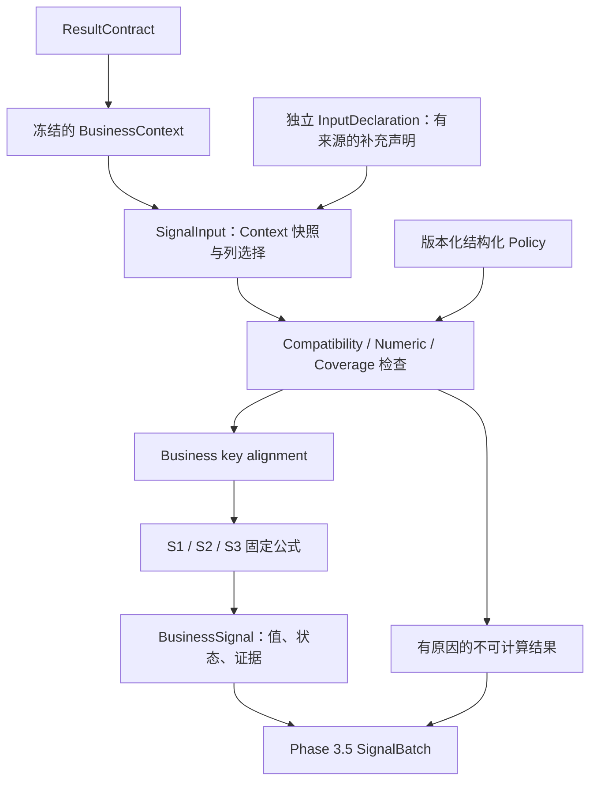

# AskData Phase 3.0 — Business Signal Contract & Policy Design Document

**文档状态：V1 设计建议；仅设计，未实现。**  
源码基线：77c1aba97c2a99571a290bd018f6dcfcd5c35d3c（feat: finalize phase 2 business context with provenance validation）。  
本轮范围：读取冻结 Phase 2 源码与 Schema，设计 Phase 3.1～3.5 的契约、规则、输入资格和测试。仅新增本文 Markdown；没有创建 business_signals 目录或任何实现文件，没有修改代码、Agent、Workflow、MCP，没有调用应用 LLM，也没有执行 SQL 或计算真实数据 Signal。

主要设计决策：

- BusinessContext 保持单次查询事实载体；BusinessSignal 是一个或多个 Context 上的确定性派生计算。
- 第一版仅有 S1 月度地区目标达成、S2 地区销售变化、S3 产品/品类销售贡献。
- 使用显式类型的三个函数；通用分发器放在 Phase 3.5。
- Signal status 为 computed / insufficient_evidence / incompatible_context / unsupported / undefined；S2 的两个输出分别记录状态。
- metric、key、时间、过滤和单位关系均由结构化 Policy 显式授权，禁止 alias/LLM 推断。
- Policy 是规则，不是本次数据的证明。冻结 Context 未提供的覆盖、源唯一性等事实，由独立、有来源并绑定本次输入的声明补充；缺失时诚实返回 insufficient_evidence。
- 不为设计方便重新解析 SQL、读取数据库补证或修改 Phase 2。

## 1. Phase 2 → Phase 3 边界

### 1.1 当前真实输出调查

主要依据：[BusinessContext / semantic models](D:/agent_study/askdata_studio/backend/app/querying/result_understanding/models.py:208)、[ResultContract](D:/agent_study/askdata_studio/backend/app/querying/result_contract.py:76)、[正式 builder](D:/agent_study/askdata_studio/backend/app/querying/result_understanding/builder.py:65)、[SCHEMA](D:/agent_study/askdata_studio/backend/app/database.py:29)。项目较早的 Signal 设计文档包含 Phase 2 实现前的设想；本文以当前源码为准，不沿用旧文档里的未实现字段。

| 信息 | 已有可信证据 | Phase 3 仍需规则或补充证据 |
|---|---|---|
| result_id | 由 producer 提供，builder 原样保留 | 一个 Signal 如何引用多次执行；它不是跨查询 metric identity |
| execution rows | canonical positional arrays；rows=None 与 rows=[] 不同 | 根据列 ordinal 安全取值；缺行/NULL/零的计算策略 |
| 输出列身份 | ColumnMetadata.id/ordinal/name，与 ColumnSemantic.column_id/ordinal 对应 | 明确选择 metric/key 列，禁止靠 output_name |
| source lineage | database/table/field，常量 []，未知 None，COUNT 关系来源 field=None | 跨表等价、允许的业务用途；语法来源不是业务授权 |
| Schema metadata | label、aliases、description、role、default_aggregation 的精确绑定 | 无统一 metric_id、currency/unit、目标口径、跨字段业务域等价 |
| actual aggregation | SUM / AVG / COUNT 等当前支持的真实 SQL 操作 | 只接受每个 Signal 明确允许的操作，不能用 default_aggregation 覆盖 |
| grain | grouped / global_aggregate、显式 grouping sources | key 对齐规则；grain 不证明源数据实体唯一性或业务总体完整 |
| filters | 结构化 WHERE/HAVING、排除的 JOIN ON/QUALIFY、literal、status | 跨源过滤等价、哪些条件改变分析范围；不解析 expression 文本 |
| time constraints | 显式上下界、开闭、date/month precision、scope | 整月/环比/同期间政策；不是业务入库完整性或源物理 dtype 证明 |
| completeness | complete_query_output / partial_query_output；应用层 truncated | SQL 输出完整不等于业务总体覆盖完整 |
| dtype / encoding | 仅实际输出列的物理类型及 canonical codec | 隐藏 WHERE 字段无输出 dtype；金额单位、精度政策另定 |
| representation_status | preserved / lossy / unsupported / None | preserved 的 DOUBLE 仍是浮点来源，不是十进制金额精确证明 |
| limitations | 阶段来源保留的诊断字符串 | 不能把自由文本当作 Policy 解析；V1 保守处理未消除的限制 |
| provenance | engine、captured_at、submitted SQL、可选 scope/snapshot refs | 时间戳接近不证明相同快照；缺少 refs 不自动补齐 |

补充数据观察只读取了上次审计已保存的 Context JSON，**本轮没有重新执行**。该已捕获样本的 sales_amount 为 DOUBLE/native_json/preserved，存在 3379043.360000001 等值，且 SQL 含 HAVING/LIMIT；整体仍可合法 resolved、complete_query_output。这说明精度与业务覆盖资格必须单独判断，而非 Phase 2 bug。

### 1.2 Layer Responsibility Contract

| 层 | 回答的问题 | 允许的职责 | 不负责 |
|---|---|---|---|
| ResultContract | 这次 SQL 实际返回了什么 | 执行事实、位置型行列、表示状态、完整性与 provenance | 业务公式、跨查询对齐 |
| BusinessContext | 这些结果来自哪里，具备什么已支持 SQL 语义 | 单次查询的 lineage、Schema binding、aggregation、grain、filter、time | 跨 Context 合并、目标达成率、增长率、业务判断 |
| BusinessSignal | 在明确口径与合格输入下，业务计算结果是什么 | 验证资格、按业务 key 对齐、确定性算术、保存证据 | SQL parsing、lineage 重建、SQL execution、alias 猜 metric、LLM 定义口径 |

允许 Phase 3 比较结构化语义、复核列/行引用和执行事实自洽；不允许通过读取 SQL 文本重新恢复缺失的语义。原 SQL 仅可作为不透明审计字段或输入摘要的一部分；摘要用于身份绑定，不能充当 SQL 等价或 LIMIT 检测。



### 1.3 V1 Signal Scope

| 支持 | 明确含义 |
|---|---|
| S1 Monthly Regional Target Attainment | 同一获授权月份/地区口径下，实付销售额与目标额的比值 |
| S2 Regional Sales Change | 获授权可比期间的地区销售额差额与变化率 |
| S3 Product Contribution | 产品编号或品类对指定销售总体的贡献比率，只能称 sales contribution |

不扩展 churn、credit risk、profit、inventory、root cause、anomaly diagnosis、customer risk：

| 不支持概念 | 当前缺少的可信基础 |
|---|---|
| churn / customer risk | 客户生命周期、流失事件定义、足够观察窗口及标签；短期订单减少不能直接等同客户流失/风险 |
| credit risk | 授信、敞口、账龄、应收、偿还/违约事件 |
| profit | 成本、费用、税务及利润口径；paid_amount 不是利润 |
| inventory | 库存数量、出入库、采购、可用库存与补货记录 |
| root cause | 因果识别或经过验证的解释规则；销售变化只是观察值 |
| anomaly diagnosis | 足够历史基线、季节性/事件证据、诊断模型及验证；几个归档月份不足以自动诊断异常原因 |

## 2. BusinessSignal Contract

### 2.1 统一模型与粒度

一个成功 Signal 描述一个业务 key 的一次**逻辑计算**。三个函数可以返回多个 Signal；不能对无法定位的地区/产品凭空造 key。

为表达 Context 级阻断，增加 scope="business_key" | "context"：无法建立 key 时，返回一个 context 级失败记录，business_key=null；不得伪造“全部地区”作为 key。正常对齐后，每个可知 key 都有结果或明确失败记录，不静默丢掉缺失的一侧。

| 字段 | 含义与来源 | 是否必需 | 谁生成 |
|---|---|---|---|
| version | Signal 契约版本，V1="1" | 必需 | Signal 模型 |
| signal_id | 本次逻辑计算的确定性身份 | 必需 | Signal 层 |
| signal_type | 三项白名单枚举 | 必需 | 类型化函数 |
| scope | business_key 或 context | 必需 | 资格/对齐层 |
| status | 统一计算终态，见第 4 节 | 必需 | Signal 层 |
| policy_id / policy_version | 精确命中的规则版本 | 必需 | 调用者提供经验证 Policy，输出复制 |
| policy_digest | 防止相同 id/version 被替换为不同规则 | 必需 | 对不可变规则定义取规范摘要 |
| calculator_version | 固定公式/算法实现版本，独立于数据与 Policy | 必需 | 已发布计算器 |
| business_key | 规范业务域、typed values、period identity | key scope 必需；context scope 为 null | Alignment / Time Policy |
| metric | current/reference 的 Policy metric IDs、获授权关系；未匹配时保留 expected identity 与匹配状态 | 必需 | Policy + Compatibility |
| current_value | S1 actual、S2 current、S3 part 的 ObservedValue | 必需对象；值可缺失/NULL/未知 | Numeric reader，引用 evidence_id |
| reference_value | S1 target、S2 baseline、S3 total 的 ObservedValue | 同上 | Numeric reader |
| computed_value | 固定输出名 → ComputationResult，不是单个标量 | 必需；失败输出也有状态，value=null | 对应 Signal 函数 |
| formula | 不另存顶层可变字符串；每个输出中存固定 formula_id/version 及操作数 evidence refs | 每项输出必需 | 固定公式注册 |
| unit | 不使用一个含糊的顶层 unit；输入值及各输出分别带 unit_id | 对 computed 输出必需 | 来源单位声明 + 公式量纲规则 |
| evidence | SignalEvidence 数组；失败也保留已经取得的证据 | 必需数组 | 确定性证据装配 |
| limitations | 结构化 Issue 数组，空时 [] | 必需 | 检查器与计算器 |

ObservedValue 至少含 presence、value、unit_id、evidence_id、source_quality。value 使用十进制文本；presence 非 present 时 value=null。不得仅靠 null 判断是 SQL NULL、缺行还是未提供 payload。

ComputationResult 至少含 status、value、unit_id、formula_id、formula_version、input_evidence_ids、numeric_quality、reason_code。value 为十进制文本或 null；status 可使用相同五种状态。S2 差额与比率的 unit 不同，因此单个 computed_value/formula/unit 标量不适用。

固定输出集合：

| Signal | computed_value keys |
|---|---|
| S1 | attainment_rate |
| S2 | absolute_change、change_rate |
| S3 | contribution_rate |

formula_id 只允许固定公式白名单，不能执行任意表达式文本、eval 或调用模型生成公式。展示用公式字符串可由固定 ID 渲染，不能作为计算入口。

### 2.2 result_id 与 signal_id

result_id 表示一次 SQL 执行；一个 Signal 通常引用两个 result_id。它们不被合并、替换或重新生成。

推荐 signal_id 为规范序列化后的内容摘要，输入包含：

- Signal version/type/scope、calculator_version；
- Policy id/version/digest；
- 规范 business key 与期间；
- 固定 role 顺序的 result_id、Context digest、列选择；
- 实际采用的补充声明 digest。

不加入当前时间或随机 UUID。同一组输入快照和规则重算，得到同一 signal_id；重新执行 SQL 产生新 result_id，通常产生新 signal_id。若需区分两次调用尝试，由外层调用者提供 run_id，不污染纯计算身份。

规范编码必须版本化、保留类型标签，明确字典排序与数字表示，不能依赖 Python hash()/集合顺序/机器 locale。包括 SQL 在内的 Context digest 只是绑定内容；不证明输入真实。

同一次请求出现**同一 result_id、不同 Context 内容**应先作为输入身份冲突拒绝，不能用两个不同 hash 掩盖。不同 result_id 也不能仅因字段/数值相同视作同次执行。

## 3. SignalEvidence Contract

### 3.1 证据字段

| 字段 | 保存内容 / 来源 | 规则 |
|---|---|---|
| evidence_id | 该 Signal 内的稳定 role/operand 引用 | 必需；用于公式操作数追溯 |
| context_role | actual/target、current/baseline、parts/total | 必需，不靠列表顺序猜角色 |
| result_id、context_version、result_contract_version、context_digest | 原输入身份与版本 | 必需，不能重新生成 result_id |
| column_id、ordinal | 从输出列身份定位 | 有指定输出列时必需；不能用 name 关联 |
| row_index | canonical rows 的零基位置 | 有真实观测行才填写；不是源订单行 ID |
| key_columns / key_values | key 列引用、raw 与 normalized typed values | 保留规范化前后的映射证据 |
| source_fields | database/table/field 三元组 | 保留原来源；关系 COUNT 可 field=None，金额 metric 不接受关系来源 |
| metric_semantic | 匹配的 Policy metric/mapping/relationship ID 与规则版本 | label 只作说明，不授权比较 |
| schema_metadata | 选中列/来源的原始 SchemaBinding 快照 | 不添加不存在的 unit 或统一 metric_id |
| aggregation | ColumnSemantic 中的实际 SQL operation | 不用 default_aggregation 替代 |
| grain | Query grain、grouping sources | 保留原 SQL grain，业务 key 是额外派生说明 |
| time | 原 TimeConstraintInfo + Policy 规范 period | 同时保留 date/month 原精度与映射结果 |
| filters | 原 FilterInfo + 非时间条件规范签名 | 不丢 WHERE/HAVING scope |
| observed_value | presence、raw canonical scalar、解码工作值 | SQL NULL 与 missing/unknown 分开 |
| dtype / value_encoding / representation_status | 原输出列观察 | 不从 Schema 的“数值”猜物理类型 |
| eligibility | completeness、truncated、counts、understanding_status、采用的 declarations | computed 必须能重放资格检查 |
| provenance | 原 execution.provenance 或 null | 不把 captured_at 当 snapshot proof |
| upstream_limitations | 原阶段限制 | 按来源保留；不得被计算成功覆盖 |

证据应为输入快照的分离副本，不持有可被后续修改的共享 list。Phase 3 不给 BusinessContext 添加字段或改写状态。

无对齐行：row_index=null、presence=missing。  
存在行但 cell=null：保留 row_index、presence=sql_null。  
rows=None：presence=unknown_payload，不是空表。  
列选择有误：记录拒绝理由，不能制造不存在的 column_id。

### 3.2 S2 可追溯示例

以下是**合成契约示例，非本轮查询或真实 Signal 计算**。假定单位和其他资格已由对应测试声明提供：

| 证据 | current | baseline |
|---|---|---|
| result_id | example-current-result | example-baseline-result |
| context_role | current | baseline |
| metric column_id / row_index | column_1 / 0 | column_1 / 0 |
| source | askdata_mock.orders_current.paid_amount | askdata_mock.orders_history.paid_amount |
| metric semantic / aggregation | actual_paid_sales / SUM | actual_paid_sales / SUM |
| key | sales_region=华北 | sales_region=华北 |
| period | [2026-08-01,2026-09-01) | [2026-07-01,2026-08-01) |
| non-time filter | order_status='已支付' | order_status='已支付' |
| canonical decimal observation | "72.00" | "100.00" |

absolute_change 引用上述两个 evidence IDs，公式 current-reference；change_rate 引用同样证据，公式 (current-reference)/reference。示例结果 -28.00 与 -0.28 必须带各自单位、精度与公式身份；不能只返回 change_rate=-0.28。

## 4. Signal Status

| status | 明确定义 | 示例 |
|---|---|---|
| computed | 所有该 Signal 必需输出都按合格输入成功计算 | target>0 且证据齐全的 S1 |
| insufficient_evidence | 必需值、匹配信息、单位或覆盖等证据缺失/未知 | rows=None、缺地区、单位未知、无可信覆盖声明 |
| incompatible_context | 有明确证据表明 Policy 条件不满足或输入相互冲突 | 实付 vs 原价、时间错配、重复 key、已知 partial、不同币种 |
| unsupported | 已知类型/能力超出 V1 | 上游 unsupported、未支持 dtype/codec、未注册 Signal/Policy 版本 |
| undefined | 输入通过业务资格，但某个必需数学表达式无定义 | baseline=0、target=0、total=0 |

五者都是公开契约，不使用 valid=True/False。编程错误（参数类型错误、非法模型结构等）可明确抛 TypeError/ValueError，不能伪装成业务 zero 或 computed；一个不合法 Policy 也不能悄悄回退到默认规则。

### 4.1 NULL / missing / 0 / unknown / unsupported

| 情形 | 值层表示 | Signal 层处理 |
|---|---|---|
| SQL NULL | sql_null，有观测行，value=null | insufficient_evidence；不补 0 |
| 完整输出中没有某 key | missing，没有对应 row_index | insufficient_evidence；不造一行 NULL 或 0 |
| payload/元数据未提供 | unknown_payload / unknown_metadata | insufficient_evidence |
| 真正的数值 0 | present，value="0" | 正常输入；仅分母触发数学规则 |
| 不支持的数据表示 | 保留 dtype/status 原因 | unsupported |
| 上游 unknown | 保留阶段来源 | insufficient_evidence，不当作合法空 |

输出不是 Infinity、NaN、"N/A" 数字替身或空字符串。已知 NULL 与“计算结果未定义”都可能 value=null，但 presence/status/reason 明确不同。

### 4.2 S2 baseline=0

保留可计算的 absolute_change；change_rate=undefined、value=null、reason_code=ZERO_BASELINE。由于 V1 两项均为必需输出，**顶层 status=undefined**，不是 computed。无需新增 partial 状态。

current=baseline=0 时，差额是 0，变化率仍是 0/0，不填 0%、100% 或“无限增长”。

全局检查先于算术：缺单位/覆盖证据同时出现分母 0，先返回 insufficient_evidence，不能绕过资格检查提前标 undefined。已知能力/兼容性问题保留全部 Issue；需要单一状态时采用 unsupported > incompatible_context > insufficient_evidence。仅资格通过后才在 undefined/computed 之间确定数学结果状态。

limitations 使用稳定结构：code、stage、context_role、result_id、key（若已知）、evidence_paths、severity、message。message 仅解释，不驱动程序判断；按固定阶段/role/key/code 顺序输出，去重不删除来源。computed 可有浮点来源或舍入说明，不能用 bool(limitations) 代替 status。

## 5. Policy Contract

Policy 是**可由确定性程序验证的、版本化规则**，不是自然语言 Prompt，也不是本次数据质量的自报证明。业务人员决定口径，工程定义合法结构与可检查规则；运行期不让模型补全。

### 5.1 统一元数据与规则面

| 字段/规则组 | 必须定义的内容 |
|---|---|
| policy_id、version、definition_digest | 精确版本与内容身份；修改语义必须换版本 |
| signal_type、supported_contract_versions | 哪个固定计算器和哪些 Context/Signal 版本 |
| required_roles | actual/target 等必需角色，禁止自动配对 |
| metric_rules | 每角色 metric ID、允许的 source 三元组、aggregation、Schema binding 要求 |
| relationship_rules | 允许 compare / divide 的经济含义与量纲关系 |
| grain_rules | 每角色真实 SQL grain、分组 source/key 集合，是否允许 total 广播 |
| key_rules | 业务域、跨源映射、typed normalization、重复和缺 key 处理 |
| time_rules | 来源时间域、calendar、获准范围形态、整月/相邻月/同范围规则 |
| filter_rules | 每角色必需/允许条件、映射后的等价规则、额外条件处理 |
| numeric_rules | codec、源质量要求、浮点许可、精度/范围、舍入、零分母规则 |
| missing_rules | SQL NULL、missing key、unknown payload 的独立处理 |
| duplicate_rules | 输出 key 与源目标记录重复分别规定 |
| completeness_rules | complete_query_output、truncated、已知 counts、row-selection/coverage 证据要求 |
| declaration_rules | 哪类外部声明可接受、适用 scope、受信来源、允许承担哪些证据缺口 |
| unit_rules | 每角色来源单位/scale 与同单位要求；不能默认元/CNY |
| limitation_rules | 相关上游限制是否允许；V1 默认拒绝未解决限制 |
| formula_refs | 固定公式 ID/version；无任意公式执行 |
| snapshot_rules | 所需冻结数据版本/可比快照声明；不读取当前时钟决定合格性 |

Policy 配置可为严格模型或不可变配置对象；不得包含可执行 SQL、自由形式代码、网络回调或 LLM prompt。默认值也属于版本化规则，不能靠运行期全局环境改变行为。

### 5.2 规则、业务声明、本次输入证据分开

- Policy 可以规定“actual_paid_sales 只允许这些来源与 SUM”“必须相同单位”“只比较完整相邻月”。
- 有来源的业务单位/时间域声明可以提供某字段的单位定义，保留 declared 证据等级。
- 本次 population、row-selection、目标源唯一性等声明必须绑定本次输入，不能在 Policy 中写 coverage=true 就当验证完成。

推荐 API 的每个角色接收 SignalInput：

```text
SignalInput
  context: BusinessContext
  selection:
    metric_column_id
    key_column_ids: business key name → column_id
    auxiliary_column_ids: optional named evidence columns
  declarations: InputDeclaration[]
```

InputDeclaration 是新增的**Phase 3 输入设计**，不是已有 BusinessContext 字段，且本轮不实现：

| 字段 | 约束 |
|---|---|
| version、declaration_id、declaration_type | 必需；类型白名单 |
| result_id、context_digest、适用 column_ids | 与独立输入快照绑定，不可移植到另一次执行 |
| issuer_kind、issuer_ref、basis_ref | 受控 fixture manifest 或已批准 capture 来源；不能由 LLM 自报 |
| claims | 严格 typed 结构：row_selection、population、unit/time_domain、source_key_uniqueness、snapshot/revision 等 |
| evidence_grade | 例如 trusted_declaration；不能写成数据库物理验证，除非确有相应证据 |
| scope | 明确来源、period、筛选后的数据范围、业务 key 域/目标版本 |

V1 计算器只能消费来自既定受信调用边界/fixture catalog 的声明。自称 issuer="trusted" 不构成信任；内容 hash 也不证明声明真实。外部认证、声明采集和完整性约束的实际建立属于 acquisition/治理边界，不在纯计算器中实现。

声明缺失→insufficient_evidence；声明与 result_id/digest/明确 Context 事实冲突→incompatible_context；不认识的声明版本/能力→unsupported。V1 不提供靠裸布尔值跳过验证的“force”参数。

## 6. Context Compatibility

推荐 ContextCompatibility 产物：

```text
operation: align | compare | divide
context_roles / result_ids
status: compatible | insufficient_evidence | incompatible_context | unsupported
issues: Issue[]
normalized_metric_refs / key_domains / periods / non_time_filters
declarations_used
input_digests
```

这是中间检查结果，不返回业务比率。compatible 仅表示该 Policy 的资格满足，不是通用业务真实性保证。

| 检查 | V1 通过条件 | 不通过的处理 |
|---|---|---|
| 身份/结构 | Context/Contract 版本支持；result_id 非空；同 ID 内容一致；列 id/ordinal/行宽一致 | 明确冲突拒绝；非法模型明确异常 |
| 执行 | success=True，rows/columns 已知 | 未知不足；失败不计算 |
| understanding | overall、必需 column/query_binding/grain/filter/time 均 resolved | unsupported 保留；unknown→insufficient |
| 表示与引用 | selection 的 column_id 存在并对应 ordinal，key/metric 无歧义 | 不靠 output_name 或首列补选 |
| output completeness | complete_query_output、truncated=False；已知 returned_rows=total_rows=len(rows) | partial/truncated→incompatible；计数/状态缺失→insufficient |
| 来源/聚合 | 完整 source identity，精确 Schema binding，命中角色 Policy；actual operation 符合 | 不同来源不自动等价；AVG 不当 SUM |
| grain | grouping source 集合符合 Policy；key 列真实投影 | 隐藏 key 或 unknown grain 不升级；额外粒度拒绝 |
| time/filter | 第 9/10 节角色规则通过 | 无法证明相同不当作相同 |
| numeric / unit | 第 11 节；已知同单位/scale 的获授权关系 | 两个 unknown unit 不等于相同 |
| coverage / revision | 第 12 节，足够声明与绑定 | 缺证据仍不足，即使 Context resolved |
| limitations | V1 对必需范围默认要求上游限制为空，或明确的结构化非阻断状态 | 不解析英文 diagnostic 来推断可安全忽略 |
| 行/key 条件 | typed key、重复检测、NULL/缺失、数值域 | 生成具体 key 失败结果，不静默丢弃 |

对消费输入先取独立快照，再检查和计算。现有 [BusinessContext 的 frozen](D:/agent_study/askdata_studio/backend/app/querying/result_understanding/models.py:208) 不等于深不可变；不对原 Context 做 in-place sort、补列、改状态或清除 limitations。

三种关系不同：

- align：必须具有明确可对应的 business-key domain，不代表 metric 可比。
- compare：必须是同一获授权 metric semantic、同单位且期间/筛选满足该比较规则。
- divide：由公式显式授权 numerator/denominator；S1 的 actual 与 target 是不同 metric，不能机械要求同 source 或同 metric_id。

Phase 3 的结构复核不重做 SQL lineage。可复用纯执行/provenance 一致性校验；不得调用 understand_columns、parse_sql 等重新解释 SQL。

## 7. Metric Mapping Policy

推荐 V1 映射表（均须包含 database，示例数据库是当前真实 askdata_mock）：

| Policy metric ID | 允许来源 | SQL aggregation | 明确关系 |
|---|---|---|---|
| actual_paid_sales | askdata_mock.orders_current.paid_amount | SUM | 与下行由此 Policy 显式授权跨表比较 |
| actual_paid_sales | askdata_mock.orders_history.paid_amount | SUM | 同一业务口径还必须满足 status/time/unit 规则 |
| regional_monthly_sales_target | askdata_mock.sales_targets.target_amount | SUM | 仅授权作为 S1 对应目标分母，不等同实付交易事实 |
| （禁止映射为上述 actual） | askdata_mock.orders_current.order_amount / askdata_mock.orders_history.order_amount | 即使 SUM 也不匹配 | 原价金额不能因 alias=sales_amount 被接受 |

列定位优先使用调用者显式 selection；若未来允许自动定位，也只能在完全匹配的 source + aggregation 候选恰有一个时选择。重复的两个 SUM(paid_amount) 输出不能选第一个；应要求明确 column_id。

标识规范延续 Phase 2：database 精确匹配；table/field 使用已定义的 ASCII 大小写规范，不做 Unicode casefold/fuzzy matching。业务 key **值**的规范化与 SQL identifier 大小写规则分开，见第 8 节。

Schema aliases 含“销售额”，只说明元数据标签，不构成跨表等价授权。目标描述“计划销售金额”也不能证明它是“已支付实付销售目标”；S1 必须有独立 relationship/kpi_basis 声明。

## 8. Business Key Alignment

| Signal | 对齐域 | SQL key 来源 | Signal 的期间身份 |
|---|---|---|---|
| S1 | sales_region + target_month | orders_current.region ↔ sales_targets.region | 由明确 date→month Policy 得到同一 month_id |
| S2 | sales_region | orders_current.region ↔ orders_history.region | 同时保存 current_period/baseline_period；不按相同月份 join |
| S3 | sales_category 或 product_id | orders_current.category 或 orders_current.product_id | parts 与 total 的共同 period；total 经授权广播 |

orders.region、customers.region、sales_targets.region 的业务定义不同。V1 不自动映射 customers.region；同名或相同 label 都不授权业务域相同。

推荐 BusinessKey 由有序的 (domain_id, component_id, value_type, normalized_value) 构成。每个 component 关联 Policy key mapping 与原列来源。输出时保留 raw value，不能只保留规范值。

V1 normalization：

- region/category 文本默认精确保持；不自动 trim、大小写折叠、简称翻译或将“华北区”合并为“华北”。
- 如确需值映射，只接受显式、版本化的有限映射表；映射来源必须可追溯。
- product_id 仅接受已验证整数域；不把任意 VARCHAR 数字猜成产品编号；bool 不是 integer key。
- NULL key 不是合法空字符串 key，默认对应输入不足；不能参与自动合并。
- 规范化后每个 Context 的同 key 多行默认 duplicate-key incompatible；即使两行值相同也不自动去重/SUM。
- S1/S2 按已知 key 的外连接集合产生结果，单侧缺 key 不补 0，不因 inner join 静默消失。
- 公共 total 多行不是可选的“第一行”；global denominator 必须唯一有效行。

SQL grain 与 BusinessKey 分开：S1 根据已经确认的月份过滤给 region 结果添加 month identity，是 Phase 3 的对齐规则，不是改写 Phase 2 query_grain。

## 9. Filter Compatibility

使用 FilterInfo/FilterCondition 的结构化内容构建规范签名：

```text
scope
+ Policy 映射后的 source identity
+ operator
+ typed literal 或 typed lower/upper bounds
```

V1 接受已 resolved 的纯 AND 谓词。AND 顺序不影响签名；精确相同条件可作幂等去重，但原证据完整保留。不比较整个 SQL 或 expression/value_sql 字符串。

字符串 "1"、整数 1、numeric_text "1.0" 不默认同义；BETWEEN 与两个比较不做通用逻辑等价归一化。条件比另一个更严格也不视作可比。当前 V1 无需建设 predicate equivalence engine。

只有同时满足以下条件的时间谓词才从普通 Filter 比较中交给 TimePolicy：

- source/scope 被该角色的时间规则明确列出；
- 对应 TimeConstraintInfo 已 resolved；
- 所有该获授权时间 source 的条件被完整消费，不能删掉未解释的 OR/NOT/动态值；
- 不根据字符串像日期或 role 标签泛化删除其他条件。

S2/S3：非时间 WHERE 签名经明确字段映射后必须一致。  
status='已支付' 对 status='已支付' 可以一致；一侧无 status 不能自动一致。额外地区、产品或品类过滤改变 population，默认拒绝不一致。

**S1 使用按角色约束，而非两侧机械相等：**

- actual 必须满足 Policy 所选实付交易口径，例如 status='已支付'。
- target 没有 status 字段，允许没有 status 的前提是 relationship 明确声明 target_amount 对应该实付/支付状态口径。
- 缺这种目标口径声明→insufficient_evidence；目标已被定义为另一种销售额→incompatible_context。
- 双方的其他地区/范围限制仍须通过显式映射一致；V1 默认不允许额外未声明的非时间条件。

V1 三个 Signal 均禁止 HAVING 作为合格输入，即使两侧 HAVING 一样，也不能证明没有删除必要 key。WHERE 与 HAVING 不合并。JOIN ON / QUALIFY / OR / NOT 等 Phase 2 unsupported 继续返回 unsupported，不在 Signal 层补解释。

## 10. Time Compatibility Policy

现有 TimeConstraint 的 precision 来自 literal；[源码明确](D:/agent_study/askdata_studio/backend/app/querying/result_understanding/time_constraint.py:174) 它不证明源物理 dtype、隐式 cast 或业务数据完整。未投影 order_date 没有输出 ColumnMetadata.dtype。

因此 Policy 必须获准使用具体来源时间域，例如 order_created_day（Gregorian、日粒度的受信 DATE/规范 ISO 日值比较域）与 target_month（YYYY-MM 月域）。单位/时间域声明保留 declared 等级，不伪造 physically_verified。没有相应来源域证据时不足。

### 10.1 S1：date range → month

推荐严格 V1 规则：

- actual 的唯一获授权 WHERE time range：
  lower=YYYY-MM-01、lower inclusive=true；
  upper=下一月第一天、upper inclusive=false；
  precision=date、is_empty=false。
- target 的唯一获授权 target_month 条件是等值 YYYY-MM；
  precision=month，两个端点相等且 inclusive。
- 显式 Policy 将二者映射到同一 Gregorian month_id。
- 不读取系统“本月”，不通过 orders_current 表名猜月份。
- 推荐 V1 不把 <=月底或 BETWEEN 月初月底自动改为半开整月；这些可能是合法 Phase 2 表达，但不符合本版精确形态要求。
- 范围完整只证明 SQL 约束了整月，数据是否已完整入库仍需 CoveragePolicy。

### 10.2 S2：month-over-month / period change

默认 S2 Policy 采用 month_over_month：

- 两侧都是上述完整自然月区间；
- baseline.end=current.start，且 baseline 是前一自然月；
- 同一获授权 calendar/time domain；
- 允许 7 月和 8 月天数不同，因为规则是自然月，而非相同天数。

完整 8 月 vs 完整 7 月可被该 Policy 接受；8 月 1–20 日 vs 完整 7 月不能自动叫环比，也不自动按天折算。

period_change 可作为同一 Signal 的另一个显式 Policy 模式：要求指定两个完整边界、非重叠顺序以及具体 duration/comparability 规则。**V1 首次实现只注册 month_over_month**；未注册的 period_change 返回 unsupported，不悄悄换标签继续计算。

### 10.3 S3：同范围

parts/total 的映射后 time domain、起止、开闭及 scope 必须完全相同。V1 要求明确有界期间，不把 Time=[] 解释成全部历史，也不允许日期范围和 month literal 未授权混用。

空交集 is_empty=true 不等于零销售；作为不符合本次有效分析期间处理。CURRENT_DATE、INTERVAL、TIMESTAMP、DATE_TRUNC 等保持 Phase 2/Signal V1 边界。

## 11. Numeric Safety

### 11.1 安全取值路径

唯一取值路径是 result_id → selection.column_id → ExecutionData.columns.ordinal → canonical rows[row_index][ordinal]。先验证身份、行宽和 key 对齐；禁止 legacy dict、output_name、UI 展示字符串或 Excel/JS 已经舍入的再输入值。

| dtype / encoding / status | V1 处理 |
|---|---|
| DECIMAL(p,s) / decimal_text / preserved | Decimal(text)，严格校验有限值、格式与声明范围，保留原 text/scale；不经过 float |
| 支持的整数 dtype / native_json / preserved | 原生精确整数，type 必须确为 int，排除 bool |
| integer_text | 契约枚举存在但当前 producer 不产出；首版 numeric reader 不默认支持，若后续启用须另有严格 dtype/整数语法规则 |
| DOUBLE/FLOAT / native_json / preserved | 仅在明确允许浮点来源的 Policy profile 中接受；保留 approximate source quality |
| VARCHAR 文本看起来像金额 | 不做猜测解析 |
| SQL NULL | 记录 sql_null，不转成 0 |
| dtype/encoding/representation 不足 | insufficient_evidence；全 NULL 列可能 legitimately 未建立 codec/status |
| lossy | V1 incompatible_context，明确违反保真要求 |
| unsupported 类型/codec、非有限值 | unsupported；非法模型数据另作明确输入错误 |

preserved 仅说明已捕获值的表示被保留，不能把 DOUBLE→Decimal 宣称恢复原始十进制金额精度。参考 [producer codec](D:/agent_study/askdata_studio/backend/app/querying/duckdb_engine.py:160) 与 [representation 判定](D:/agent_study/askdata_studio/backend/app/querying/duckdb_engine.py:190)。

### 11.2 推荐精度 Profile

设计两个显式 profile，不自动降级：

| Profile | 来源许可 | 适用说明 |
|---|---|---|
| decimal_exact_v1 | 合格 Decimal text 与精确整数 | 输入观察可精确读取；不承诺每个除法结果都是有限精确小数 |
| reporting_approx_v1 | 上述类型 + preserved FLOAT/DOUBLE | 适合当前 CSV 报表来源；computed 必须标记 binary_float_source/approximate，不作账务级精确承诺 |

推荐默认安全 profile 为 decimal_exact_v1；当前 DOUBLE 数据若需计算，必须显式选择 reporting_approx_v1，不因默认失败自动切换。

浮点工作值采用“已接收浮点值的最短 round-trip 十进制文本”转 Decimal；原 canonical float 同时保留。该步骤是确定性的工作数选择，不是修复源数据精度。混合 exact/float 时整体 source_quality 继承 approximate。

建议冻结以下计算域，避免依赖进程全局 Decimal context：

- 局部 precision=80，ROUND_HALF_EVEN；不修改 getcontext().prec。
- 初版批准输入绝对值 < 10^38，工作值最多 18 位小数；超范围/scale 明确 unsupported，不静默截断。
- parts 行数采用显式资源上限（建议 10,000）；不把资源上限当业务截断后继续计算。
- 金额输入不预先量化为两位；absolute_change 保留批准工作值的差额，不无条件截到分。
- 比率只在最终输出量化为 12 位小数；记录 arithmetic_rounding 与 scale。
- 金额展示精度来自单位规则，绝不能默认所有单位都有两位小数。
- ratio 使用无量纲 unit_id="ratio"；值是 "0.28"，不是 "28%"。百分比是展示转换。
- 精确零只按批准工作值判定；浮点很小的残差不能用容差偷偷当 0。

精度范围、量化和异常必须有边界测试；域内加减不得悄悄 Inexact，除法/输出舍入要标注。数学定义与数值质量分开：exact 输入的 1/3 也需要输出舍入；浮点输入即使没有新增舍入仍为近似来源。

S3 数值核对容差仅用于一致性检查：exact profile 要求和精确一致；approx profile 可显式配置绝对/相对容差（建议相对 1e-12，绝对容差随获确认单位配置）。容差不用于单位未知、分母零判定或覆盖证明。

## 12. Completeness / Coverage Policy

### 12.1 三个不同问题

1. **执行输出完整**：是否完整拿到了这条 SQL 的输出？
2. **查询口径合格**：分组、metric、过滤与时间是否符合当前计算角色？
3. **业务范围覆盖**：该查询定义的数据范围是否覆盖声明的地区/产品/月份业务范围？

[ExecutionData](D:/agent_study/askdata_studio/backend/app/querying/result_contract.py:76) 的 total_rows/completeness/truncated 主要回答第 1 项。WHERE/HAVING/Time/Grain 回答第 2 项的一部分；第 3 项不是行数可以证明的。

### 12.2 冻结接口无法自动检测 LIMIT

BusinessContext/ExecutionData **没有结构化 LIMIT/OFFSET/top-N/row-selection 字段**。[prepare_query_bindings](D:/agent_study/askdata_studio/backend/app/querying/result_understanding/schema_binding.py:100) 明确只处理 SELECT/WHERE/HAVING/plain GROUP BY。

因此本设计不声称 Phase 3 能从任意 Context 自动检测 LIMIT，也不写 regex 扫描 SQL。必须保持以下规则：

| 已有证据 | 判定 |
|---|---|
| partial_query_output 或 truncated=True | 已知不满足完整输出要求，incompatible_context |
| completeness/truncated/counts 未知 | insufficient_evidence |
| complete_query_output + truncated=False，但无 row-selection/coverage 声明 | 仍不足以证明业务覆盖，insufficient_evidence |
| 受信声明明确存在 LIMIT/OFFSET/top-N/其他删除行的选择 | V1 incompatible_context |
| 绑定当前 Context 的受信无 row-selection 声明、合格 population/revision 证据 | 继续其他检查，不直接等同 computed |
| 有 HAVING | 可由 FilterInfo 明确发现，V1 不合格 |
| grouped 结果 | 仅表示当前输出分组，不能证明所有分组均在 |
| global aggregate | 仍检查实际一行、NULL、WHERE/time、来源与 coverage；不是自动完整分母 |

V1 对所有角色保守要求 row-selection-absent：即使某个非零 LIMIT 对单行 global aggregate 实际无影响，也不通过语义推理豁免。无声明时拒绝的是**缺失证据**，不是断言 SQL 一定包含 LIMIT。

### 12.3 S3 denominator 与业务总体

V1 total 必须：

- 独立 global_aggregate Context，grouping_columns=[]；
- 指定列为同一 Policy metric 的直接 SUM；
- 恰好一个有效结果行，数值非 NULL；一行不等于值为 0；
- complete/untruncated 与计数自洽；
- 无 HAVING，time 与非时间 filters 和 parts 一致；
- 同单位、获准数值表示；
- 声明所针对的 population_scope/time/revision 与 parts 一致；
- 无结果选择，并有相应受信依据。

parts 必须声明覆盖该 population 的完整 category 或 product_id 分区，只有该单一获准 key 粒度，无重复/NULL key。没有分区覆盖证据，不声称“全部产品贡献分布”。

不将 Top10 grouped 之和充当 total。V1 不提供“只观察 TopN 但称完整分布”的模式，也不自动从一个 grouped Context 推导 denominator；首版固定要求显式 total_context。

sum(parts)==total 只可作额外数值一致性检查，不能单独证明覆盖：遗漏项可能为零或相互抵消。两侧 total 相等也不证明来自相同快照。

snapshot/revision Policy 推荐要求同一受信冻结数据集版本或明确获授权的可比快照对；不能仅比较 captured_at。缺少 snapshot_ref 可由绑定输入的受信 revision 声明承担相应要求；两者都没有时不足。计算器不读取当前时间判定“最新”。

## 13. S1 Policy — Monthly Regional Target Attainment

推荐角色与输入：

| 项目 | actual | target |
|---|---|---|
| metric | actual_paid_sales | regional_monthly_sales_target |
| 来源 | orders_current.paid_amount | sales_targets.target_amount |
| 实际聚合 | SUM | SUM |
| SQL grain | grouped，唯一 region source | grouped，唯一 region source |
| 时间 | 获批准的整月 date 半开区间 | 同月份 target_month 等值 |
| 非时间过滤 | 推荐 candidate 为 status='已支付'，禁止未声明额外条件 | 无 status 条件，但必须有与 actual 口径对应的目标定义 |
| 单位 | 已知金额单位与尺度 | 同单位同尺度 |
| 额外证据 | period/population/revision/row-selection | 同左，另加目标源唯一性/版本依据 |

上述 status 选择是**建议的业务 Policy**，不是 SCHEMA 已经强制定义的条件。单位、目标对应的支付/退款口径与数据覆盖来源仍需显式业务确认；不能把本文建议当作已经核实的生产事实。

对齐 key=month_id + sales_region。只在聚合 Context 之间对齐，不设计 raw orders JOIN target。

公式：attainment_rate = actual_sales / target_amount。允许大于 1，不 clamp 成 100%，不额外生成“优秀/风险”判断。

| 情形 | V1 规则 |
|---|---|
| 缺 target region | insufficient_evidence，MISSING_TARGET |
| 缺 actual region | insufficient_evidence，MISSING_ACTUAL；不补 0 |
| 金额 SQL NULL | insufficient_evidence |
| target=0 | undefined，ZERO_TARGET；0/0 同样未定义 |
| target<0 或 actual<0 | incompatible_context，超出推荐非负销售/目标口径；不取绝对值/截成 0 |
| actual=0、target>0 | computed，比率 0 |
| 输出重复 key | incompatible_context |
| 单位未知 | insufficient_evidence；比率无量纲也不能豁免输入同单位要求 |
| 单位已知不同 | incompatible_context；V1 不做汇率/单位转换 |
| precision 不合格 | 按 NumericPolicy 返回 unsupported 或质量不兼容，不隐式 float |

### 13.1 目标源唯一性不能从 SUM 结果证明

[SCHEMA](D:/agent_study/askdata_studio/backend/app/database.py:99) 仅声明 target_id 主键；这不证明 (region,target_month) 唯一，也不代表 CSV 强制执行该主键。

两条同月同地区目标记录经 SUM 后可以只剩一行。**输出 key 唯一**与**原目标记录唯一**是两项不同证据。

推荐 V1 target_duplicate_policy=reject：

- 要求受信声明说明当前 period/scope/目标版本下 (region,target_month) 源记录唯一；
- 缺声明→insufficient_evidence；
- 已知重复→incompatible_context；
- 不自动 sum/max/first/latest；Schema default sum 不能替代目标业务唯一性政策。

后续 acquisition 可以准备额外 count-all-rows 证据，但 Signal 本身不得发 SQL 补查。且当前 Phase 2 的 COUNT(*) / COUNT(literal) 都可能是 COUNT + relation lineage.field=None，单凭这些字段不能证明“全记录数”；COUNT(target_id) 也可能忽略 NULL。若采用辅助 count，必须有受控模板/声明明确其 count-all-rows 语义及 scope，不能重新解析 expression 来补证明。首版不把这种辅助路径作为默认捷径。

## 14. S2 Policy — Regional Sales Change

输入 current_context 与 baseline_context；默认 Policy 为完整相邻自然月比较。

必要条件：实际 SUM 聚合、region grain、获授权 current/history 实付 metric 等价、同单位、非时间筛选一致、明确完整可比期间及 coverage/revision。不能因为都叫 paid_amount 就授权比较。

固定公式：

- absolute_change = current - baseline。
- baseline != 0 时 change_rate = (current - baseline) / baseline。

| 情形 | absolute_change | change_rate / 顶层 |
|---|---|---|
| current=72，baseline=100（合成例） | -28 | -0.28 / computed |
| current>0，baseline=0 | 保留 current-0 | undefined / undefined |
| current=0，baseline=0 | 0 | undefined / undefined |
| 任一值 NULL / key 缺失 | 不计算 | insufficient_evidence |
| 任一值 <0 | 推荐 V1 不支持该 signed-sales 业务口径 | incompatible_context |
| 当前部分月 vs 完整基期月 | 不作为 MoM 计算 | incompatible_context |
| 时间缺失 / coverage 未知 | 不计算 | insufficient_evidence |

current/baseline 的非负约束不禁止差额和变化率为负；销售下降是合法计算结果。分母零不生成“新增业务”“无限增长”或原因诊断。缺地区不补零；未来如需要补零，必须单独版本化并具备“缺行意味着该 key 没有符合条件的源记录”的可靠证明。

## 15. S3 Policy — Product Contribution

输入 parts_context 与 total_context。V1 选择 category **或** product_id 粒度，每次仅一种；不能把 product_id+category 的多层 grain 无声明压平。

| role | 必需条件 |
|---|---|
| parts | SUM(paid_amount)，单一获准 product/category grouping source，完整分区覆盖、无重复/NULL key |
| total | 同 metric 的独立全局 SUM、空 grouping_columns、唯一非 NULL 数值行、完整 denominator 证据 |
| 共通 | time、non-time filters、单位、population/revision 一致，无 HAVING/row selection |

公式：contribution_rate = part / total。仅称销售贡献，不称利润贡献。

V1 默认非负 sales composition：

- part<0 或 total<0：incompatible_context，不计算“负贡献”解释。
- total=0 且全部已知 parts=0，其他证据充分：各比率 undefined，ZERO_TOTAL。
- total=0 却出现正 part：已知分区/分母冲突，incompatible_context 优先于除零结果。
- part>total 或 sum(parts) 与 total 不一致：超过 NumericPolicy 的获准核对容差时 incompatible_context。
- 近似容差不改变真实零分母判定，也不能证明 population 完整。
- NULL part、缺 total、grouped total、多行 total：明确失败；不取第一行或补零。
- exact profile 对分区数值核对要求精确相等；approx profile 保留浮点来源说明。
- 量化后的比率之和可能因舍入不严格等于 1，不人为调整最后一项掩盖差异。
- parts 已知空且没有任何可定位 key 时，不虚构产品 Signal；返回 context 级 insufficient_evidence/NO_OBSERVED_PARTS，不能把空列表声称为“全部贡献均为 0”。

## 16. Signal API Recommendation

| 维度 | A：generic compute_signal(type, contexts, policy) | B：typed functions |
|---|---|---|
| 类型安全 | role/Policy 错配主要靠运行时发现 | 参数角色与 Policy 类型明确 |
| 可读性 | contexts[0]/[1] 容易混淆 | actual/target、current/baseline、parts/total 明确 |
| 测试 | 分发、角色装配、公式容易混测 | 每个公式独立测，共享资格规则单测 |
| V1 工程复杂度 | 容易过早建设 registry/plugin/动态公式 | 三个窄入口即可 |
| 面试解释价值 | 需要先解释通用引擎抽象 | 能直接说明输入资格、对齐、公式与证据边界 |

**推荐 B。** 设计签名如下，仅为接口草图，不是实现：

```text
compute_target_attainment(
  actual: SignalInput, target: SignalInput, policy: TargetAttainmentPolicy
) -> ordered list[BusinessSignal]

compute_sales_change(
  current: SignalInput, baseline: SignalInput, policy: SalesChangePolicy
) -> ordered list[BusinessSignal]

compute_product_contribution(
  parts: SignalInput, total: SignalInput, policy: ProductContributionPolicy
) -> ordered list[BusinessSignal]
```

SignalInput 包装的是现有 BusinessContext、列选择和可选 declarations；不是新查询结果，也不合并 result_id。缺 declarations 可以得到明确不足状态，不能要求默认 computed。

全局不合格返回一个 scope=context 的失败 Signal；通过全局检查后按规范 key 顺序输出每 key 结果。缺失单侧 key 输出明确不足记录，不能只返回交集。

Phase 3.5 才可加白名单 generic dispatcher，内部只委托上述函数；不能根据可用 Context 自动猜测应计算哪种 Signal 或哪个 role。

## 17. Module Structure

建议未来目录如下，**本轮不创建**：

```text
backend/app/querying/business_signals/
  models.py
  policies.py
  compatibility.py
  alignment.py
  numeric.py
  target_attainment.py
  sales_change.py
  product_contribution.py
  engine.py
```

| 文件 | 引入阶段 | 职责 |
|---|---|---|
| models.py | 3.1 | Signal/Input/Evidence/Issue/Compatibility 基础契约；3.5 再补 Batch |
| policies.py | 3.1 | 严格 Policy 类型、显式 metric/key/time/filter 映射与配置校验；不访问 SCHEMA 自动推断 |
| compatibility.py | 3.1 | 结构化元数据、time/filter/coverage/declaration 资格检查；先用有界 helper，不再复制 SQL readers |
| alignment.py | 3.1 | 按 column_id/ordinal 读取 key、规范化、索引、重复/缺失诊断；不做原始订单 join |
| numeric.py | 3.1 | 共用安全读取、局部精度、codec/质量与输出量化；值得独立，避免三公式各自转 float |
| target_attainment.py | 3.2 | 只组合已定义检查/对齐与 S1 固定公式 |
| sales_change.py | 3.3 | S2 两个固定输出与 zero baseline 规则 |
| product_contribution.py | 3.4 | S3 denominator/分区一致性与固定比率 |
| engine.py | 3.5 | 显式 job 分发、Batch 汇集、顺序/状态计数；不做 query planning |

不建立 Repository、Agent、LLM router、通用 SQL/parser、通用公式引擎或动态插件机制。暂不为每项检查机械拆出单独文件；后续只在复杂度确有需要时再拆 time/filter helper。

## 18. Workflow Boundary

明确分离：

| 问题 | Phase 3 V1 是否负责 |
|---|---|
| A：已有合格 Context 的资格检查、对齐与业务计算 | 是 |
| B：如何规划多条 SQL、获取 current/target/baseline/total、建立覆盖和源唯一性证据 | 否 |

V1 调用者显式提供所需输入、列选择、获批准 Policy 与 declarations。缺输入时计算器返回不足或明确参数错误，不触发 Agent 工具调用或 SQL 查询补齐。

未来 Agent/Workflow 接入应是独立任务：它可以调用受控 acquisition 来准备多个 Context，但不能让 LLM 自行授权 metric 等价、币种、coverage 或目标版本。Signal 不回写 Context，也不根据用户 Query 改计算范围。

对于仅消费现有 arbitrary BusinessContext 的调用者，某些输入会因缺覆盖/单位/唯一性证据被拒绝。这是冻结边界下的正确行为，不要求立即修改 Phase 2 来实现 Phase 3.1。

## 19. Implementation Sequence

| 阶段 | 输入 | 输出 | 新增/扩展模块 | 测试重点 | 完成标准 |
|---|---|---|---|---|---|---|
| 3.1 Compatibility / Alignment | 已捕获 BusinessContexts、显式 selections、typed Policy、可选受信 declarations | ContextCompatibility、规范 key 索引、带来源的 decoded values、明确失败原因 | models、policies、compatibility、alignment、numeric | 同 alias 异 source、聚合/粒度冲突、None/NULL/0、key 重复、时间/过滤、缺覆盖声明、声明错绑、数值边界 | 不含业务公式也能稳定判定资格；缺证据诚实拒绝；不 parse/execute SQL、不修改输入；确定性与原 Phase 2 回归通过 |
| 3.2 Target Attainment | actual/target SignalInput + TargetAttainmentPolicy | 按 month+region 的 attainment_rate / 明确失败 Signal | target_attainment；必要的 S1 policy 定义 | 原目标记录唯一性、非 paid 目标口径、单位、零/负/NULL/缺失、输出重复、source 声明缺失 | 只有明确匹配与足够证据才 computed；零目标 undefined；审计证据含两个 result_id；真实 producer 的已捕获 fixture 可消费 |
| 3.3 Sales Change | current/baseline + 显式 MoM Policy | absolute_change 与 change_rate 的分输出状态 | sales_change | 相邻整月、跨年、不同天数、部分月拒绝、baseline=0、缺地区、负变化合法 | baseline=0 保留差额且顶层 undefined；不填补缺地区；不推断趋势原因 |
| 3.4 Product Contribution | parts/total + ContributionPolicy | 每 product/category 的 sales contribution | product_contribution | global total、单行/NULL、coverage/top-N、筛选/期间一致、分区核对、零总额与矛盾输入 | 无完整分母证据不计算；不把分组总和等价为覆盖证明；不称 profit contribution |
| 3.5 SignalBatch / Engine | 显式类型的计算 jobs 与 role bundles | 有序 SignalBatch、逐 Signal 状态/证据、状态计数 | engine；models 增 Batch | 混合 computed/undefined/不足；一个 job 失败不污染其他；ID/顺序稳定；无自动选型查询 | 仅白名单分发与聚合；全部计算仍可独立调用；无新 Agent/Workflow 耦合 |

SignalBatch 推荐含 version、batch_id（由明确 jobs/输入摘要确定）、signals、status_counts、job-level issues。不要只给 valid 或“最后一个 Signal 的 status”。混合结果按各自 status 保留，不把数值再求和/平均，不因一个失败丢弃已成功 Signal。

Phase 3.1 可以先对受控合成/已捕获 fixture 实现纯计算资格；生产级声明签发/采集不混入该阶段。后续接入真实请求前，必须落实单位、目标业务口径与声明来源。

## 20. Testing Strategy

本节是后续测试设计；**本轮未新增或运行测试，未执行 SQL**。

| 测试组 | 必须覆盖 |
|---|---|
| 契约与身份 | 多 result_id、duplicate column names、选择错误、同 result_id 不同内容、版本不支持、输入/Policy/声明变化引起 ID 变化；相同输入重算 ID 相同 |
| metric mapping | sales_amount alias 来自 order_amount 必须拒绝；同名字段跨表/数据库无授权不比较；AVG/default sum 不混用 |
| key alignment | 精确值匹配、明确映射、规范化碰撞、bool/int 区分、NULL key、缺行、重复 key、S2 不能按同月 join |
| filters | AND 顺序变化可等价；typed literals 不隐式转换；status 缺失/不同；S1 角色口径桥接必须明确；HAVING/OR/NOT 拒绝 |
| time | 月初到下月初、跨年、闰月、不同月天数、缺端点/开闭不同、部分月、无时间、不同 source domain；无系统时间依赖 |
| numeric | exact Decimal text、整数、DOUBLE 明确许可、lossy/unknown/unsupported、NULL/0、最大幅度/scale、极小非零分母、舍入边界；全局 Decimal context 不变 |
| completeness | partial/truncated、unknown counts、known empty、LIMIT 存在的已捕获 Context 仍可能 resolved；缺声明必须不足，不能因数值看起来齐全就通过 |
| declarations | 缺失、非受信来源、未知版本、result_id/digest/scope 不符、与真实 Context 冲突；不能凭 coverage=true 或同名 issuer 放行 |
| S1 | 源重复被 SUM 隐藏、输出 key 唯一但无源唯一性证据、辅助 COUNT 并非 count-all-rows、目标缺失/零/负、单位与目标口径未确认 |
| S2 | baseline=0/current=0 或正数，absolute_change 保留、rate undefined；缺地区不补 0；下降可 computed |
| S3 | total grouped/多行/NULL、time/filter 不同、TopN、coverage 未证、total=0 但 part>0 的冲突、完整分区核对、舍入后比例和 |
| purity | 预先准备 Context 后再封锁 sqlglot parsing、DuckDB execute/connect、LLM/clock；所有 Signal 路径包括失败均不触发；Context/Policy/声明深比较不变 |
| determinism / Batch | A→B→A 无状态泄漏；行/key 输出顺序规范；混合成功失败不互相覆盖；诊断顺序与 ID 稳定 |

构造测试 Context 时可使用正式 Phase 2 builder 与显式捕获事实 fixture；禁止把测试期间使用的 SQL parsing 误计为 Signal 层行为。需要真实 producer 的 fixture 获取属于隔离 acquisition 回归，在其完成后再封锁 Signal 的数据库与解析入口。

后续每阶段运行新增专项、相关 Signal 套件及既有 backend 全量回归。不得为通过测试放松冻结 Phase 2 的 unsupported 边界。断言应验证算术、资格拒绝、来源引用和输入不变，不能只断言函数返回对象或 status 字符串。

## 21. V1 Explicit Limitations

1. 仅 S1/S2/S3，不扩展风险、利润、库存、异常或原因诊断。
2. Signal 不支持任意 SQL，也不继承“Phase 2 resolved 就可以计算”的假设。
3. Phase 2 缺 LIMIT/OFFSET/业务范围裁剪结构化证据；V1 不补解析，使用独立受信声明或返回不足。
4. Schema 无统一 metric_id、币种/单位、目标口径和跨表 domain 等价；这些必须显式定义，不能由 label/alias/LLM 猜测。
5. 源目标唯一性不由聚合结果证明；缺证据不能自动挑一条目标或加总重复。
6. 隐藏时间字段没有输出物理 dtype；time precision 只来自已知 literal。时间域声明须保持其真实证据等级。
7. coverage、snapshot/revision 和声明可信来源的取得属于 acquisition/治理，不属于纯计算；Context digest 是绑定，不是事实真实性证明。
8. Source SUM 的既有 SQL NULL 处理属于原执行语义；Context 不证明源表每个业务金额都非 NULL。V1 指标必须明确是该获批准口径下 SQL SUM 的观察值，不能扩张为完整财务账簿证明。
9. 默认 exact profile 不计算 DOUBLE；仅显式 reporting_approx profile 才允许近似来源，且不恢复十进制精度。
10. 默认不转换单位/币种，不处理负销售构成，不补缺失为零，不推断本月，不支持通用 period-change 模式或 TopN subset contribution。
11. 不自动重新聚合任意结果；S3 首版显式要求独立 total，不建设通用公式引擎。
12. S2 ratio undefined 时可以保留 absolute_change；消费者必须检查每输出及顶层状态。
13. 浅冻结 Context 仍可能被消费者修改；读取独立快照，保留摘要和引用，不回写原输入。
14. P2-02 双 parse、hidden GROUP BY、HAVING COUNT(*) Time unknown、JOIN/CTE/window 等冻结 V1 限制不在本轮修改范围。
15. 同期多查询规划、数据采集、鉴权接入、声明签发与 Workflow 展示均留在后续独立任务。

**可以据此开始 Phase 3.1 的 Compatibility / Alignment 工程工作。** 需要先冻结结构化契约与数值/状态规则；生产 Policy 的单位、目标支付/退款口径、地区域映射、目标唯一性来源和总体覆盖/快照声明仍应由明确业务与数据来源确认。未确认的事实应产生不足状态，不能由实现者为了让 demo computed 而自动补齐。

本轮仅产出本设计文档；没有实现 Signal，没有修改冻结 Phase 2。
