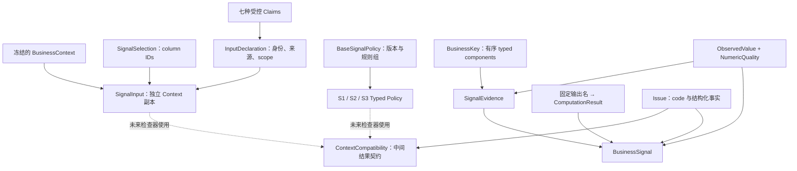

# Phase 3.1A — Signal Foundation Contracts Implementation Report

本阶段已完成基础契约与 Policy 模型。新增模型专项 **33/33**、Policy 专项 **24/24**；backend 全量 **507/507** 通过，原有 450 项无回归。

基线为 `77c1aba97c2a99571a290bd018f6dcfcd5c35d3c`。实施前后核对原有 91 个源码与测试文件的 SHA-256，全部未变。Phase 1、Phase 2、Agent、Workflow、MCP、SQL execution 均未修改。

## 1. 新增文件

| 文件 | 本轮职责 |
|---|---|
| [models.py](D:/agent_study/askdata_studio/backend/app/querying/business_signals/models.py) | 输入、声明、观察值、业务 key、状态、Issue、Compatibility 结果、Evidence、Signal 契约及结构校验 |
| [policies.py](D:/agent_study/askdata_studio/backend/app/querying/business_signals/policies.py) | 公共规则模型、三种 Typed Policy、规则定义自身的一致性校验 |
| [__init__.py](D:/agent_study/askdata_studio/backend/app/querying/business_signals/__init__.py) | 包说明；没有导入执行器或注册 Engine |
| [test_business_signal_models.py](D:/agent_study/askdata_studio/backend/tests/test_business_signal_models.py) | 33 项模型专项测试 |
| [test_business_signal_policies.py](D:/agent_study/askdata_studio/backend/tests/test_business_signal_policies.py) | 24 项 Policy 专项测试 |
| 本报告 | 本轮实现、验证和未实现范围 |

未创建 compatibility.py、alignment.py、numeric.py、三个 Signal 计算模块或 engine.py。Phase 3.0 设计文档是本轮开始时已存在的未跟踪文件，本轮未修改。未执行 git add 或提交。

## 2. 模型关系图

下图表示数据结构关联，不表示已存在调用流程。



## 3. SignalStatus

使用严格 Literal 白名单：

| 状态 | 契约含义 |
|---|---|
| computed | 业务计算结果已产生 |
| insufficient_evidence | 必需输入或证据不足 |
| incompatible_context | 输入或口径已知不兼容 |
| unsupported | 超出支持能力 |
| undefined | 合格输入下数学表达式无定义 |

本轮只保存调用者提供的状态，不实现状态优先级或完整决策逻辑。未知字符串、bool 和 success/fail 等替代状态被拒绝。

Issue 保存 code、stage、context_role、result_id、key、evidence_paths、severity、message。stage/severity/role 为有限类型；code 保留可扩展的非空字符串。程序未来依据 code 与 typed facts 判断，message 不被解析执行。

## 4. CompatibilityStatus

独立枚举为 compatible、insufficient_evidence、incompatible_context、unsupported，明确拒绝 computed。

[ContextCompatibility](D:/agent_study/askdata_studio/backend/app/querying/business_signals/models.py:337) 包含 operation、context_roles、result_ids、status、issues、normalized_metric_refs、key_domains、periods、non_time_filters、declarations_used、input_digests。

operation 仅 align / compare / divide。result_ids 与 input_digests 使用 role → 非空文本映射；metric、period、filter、声明引用均为具体模型，未使用任意字典承载语义内容。

该模型不检查两个 Context 是否可比，也不计算或产生上述结果。

## 5. SignalInput

[SignalInput](D:/agent_study/askdata_studio/backend/app/querying/business_signals/models.py:271) 的三个字段为：

- context: BusinessContext。
- selection: SignalSelection。
- declarations: list[InputDeclaration]，默认独立空列表。

SignalSelection 保存 metric_column_id、key_column_ids、可选 auxiliary_column_ids。映射的 key 是业务 component 名，值是结果内 column_id；不会根据 output_name 自动选列、改列或补选。

构造时对已提供的 BusinessContext 做 `model_copy(deep=True)`，保留全部原始事实与 result_id，不重建 BusinessContext。原 Context 与新输入中的嵌套行、元数据列表相互隔离；消费者仍不得原地修改输入。

此阶段允许保存一个尚未核实存在的 column_id。判断列是否存在、声明是否匹配 Context 及 provenance 是否足够，属于后续 Compatibility logic。

## 6. InputDeclaration

[InputDeclaration](D:/agent_study/askdata_studio/backend/app/querying/business_signals/models.py:243) 实现 version、declaration_id、declaration_type、result_id、context_digest、column_ids、issuer_kind、issuer_ref、basis_ref、claims、evidence_grade、scope。

DeclarationClaims 是封闭的可选字段模型；每份声明必须恰好填入与 declaration_type 对应的一个领域。不同领域可通过多份声明提供，不能混入未声明的事实。

| 声明领域 | 具体结构 |
|---|---|
| unit | 明确 source fields、unit_id、unit_scale、可选 display_scale |
| time_domain | 来源、domain、Gregorian calendar、date/month precision、比较域、可选 timezone |
| row_selection | absent / limit / offset / top_n / other 与可选边界；absent 不允许同时携带边界 |
| population | population_scope_ref、complete / incomplete / unknown、partition key domains |
| source_key_uniqueness | 来源 key fields、key domains、unique / duplicate / unknown |
| snapshot_revision | dataset_ref、revision_ref、可选 comparison_group_ref |
| metric_basis | metric 与对应 metric、basis_id、可选支付状态定义；承载 S1 目标口径声明 |

scope 包含来源、可选 period、population/filter 范围引用、key domains 和目标版本。当前受控 issuer_kind 为 fixture_catalog / approved_capture，evidence_grade 为 trusted_declaration。

这些字段记录声明及其来源，不认证 issuer，也不证明 digest、覆盖或源唯一性为真。真实绑定与受信来源检查尚未实现。未知 claims、额外字段和裸 coverage=True 均拒绝。

## 7. BusinessKey

BusinessKey 保留有序 components 和可选的按角色期间信息。每个 BusinessKeyComponent 包含 domain_id、component_id、value_type、raw_value、normalized_value。

V1 key value_type 仅 string / integer，raw 与 normalized 均须严格匹配声明类型。integer 不接受字符串 "1"、bool 或浮点数。重复 component identity 被拒绝，但不会执行地区映射、trim、casefold 或行级对齐。

输入顺序原样保留；未使用 Python hash()、dict hash 或 set 生成业务身份。提供不同 raw/normalized 值只表示调用者提供了这两个值，模型不会执行或核实规范化过程。

## 8. ObservedValue

ObservedValue 包含 presence、value、unit_id、evidence_id、source_quality。

| presence | value 约束 |
|---|---|
| present | 必须为非空文本；"0" 是合法观察值 |
| sql_null | 必须为 None |
| missing | 必须为 None |
| unknown_payload | 必须为 None |
| unknown_metadata | 必须为 None |

value 为 str | None，不做 Decimal/float 转换，也不在本阶段解析数值文本语法。numeric reader 将负责判定文本、dtype、codec 是否能够安全计算。

NumericQuality 分别保存 source_fidelity（exact / approximate / unknown）、source_kind、arithmetic_rounding 和可选 scale。binary_float 不允许宣称 exact 十进制来源保真；此处仅拒绝矛盾标签，不进行运算。

## 9. SignalEvidence

[SignalEvidence](D:/agent_study/askdata_studio/backend/app/querying/business_signals/models.py:362) 覆盖附件要求的执行身份、列/行定位、key、source fields、metric semantic、aggregation、grain、time、filters、observed_value、dtype/encoding/representation、eligibility、provenance、upstream_limitations。

另外保留 schema_metadata、normalized period/filter 与 raw_value。raw_value 使用 Phase 1 的严格 JsonScalar，可保留原始 canonical DOUBLE，而 ObservedValue.value 保存未来批准使用的文本观察值；不会用后者覆盖原值。

定位规则：

- column_id 与 ordinal 同时出现或同时缺失，不能根据 name 构造身份。
- present / sql_null 必须保留真实 row_index。
- missing / unknown_payload 不得声称存在已观察行。
- unknown_metadata 可保留真实 row_index 和 raw_value；元数据不足不等于没有观察行。
- 非 NULL raw_value 必须有观察行；sql_null 不能同时带非 NULL 原值。

row_index 始终是结果行位置，不是订单或其他源实体 ID。时间、过滤、grain、lineage、provenance 复用 Phase 2/Phase 1 公开模型，未重新解释 SQL。

## 10. BusinessSignal

[BusinessSignal](D:/agent_study/askdata_studio/backend/app/querying/business_signals/models.py:435) 实现 version、signal_id、signal_type、scope、status、policy_id/version/digest、calculator_version、business_key、metric、current_value、reference_value、computed_value、evidence、limitations。

scope=business_key 时必须有真实 BusinessKey；scope=context 时 business_key 必须为空，避免为全局拒绝记录伪造地区或产品。

| signal_type | 固定 computed_value keys |
|---|---|
| monthly_regional_target_attainment | attainment_rate |
| regional_sales_change | absolute_change、change_rate |
| product_contribution | contribution_rate |

ComputationResult 保存 status、value、unit_id、formula_id/version、input_evidence_ids、numeric_quality、reason_code。computed 必须有文本值与单位；其他状态不携带伪造的计算值。formula_id 仅四个固定公式名，且必须与所属输出 key 对应。

模型可以容纳 S2 差额 computed、变化率 undefined、顶层 undefined 的契约样本；测试值均为预先给定，未运行公式。本轮不推导顶层状态或验证算术正确性。

result_id 仍是执行身份，signal_id 是未来派生计算身份，允许多个 result_id 出现在一个 Signal 的 evidence 中。本轮仅定义 ID/digest 字段，未生成 UUID、读取时钟或实现 canonical digest 算法。JSON 往返稳定不等同已经冻结规范化身份算法。

## 11. Policy 模型

[BaseSignalPolicy](D:/agent_study/askdata_studio/backend/app/querying/business_signals/policies.py:268) 提供 policy_id、version、definition_digest、signal_type、supported_contract_versions、required_roles 及全部 15 个规则组：

| 规则组 | 定义的要求 |
|---|---|
| metric_rules | 每角色 metric/mapping identity、明确来源、允许聚合、Schema binding 要求 |
| relationship_rules | align / compare / divide 的角色、metric 和量纲关系 |
| grain_rules | grouped / global_aggregate、来源分组键、total 广播许可 |
| key_rules | key 域、来源角色、类型、identity 或显式版本化值映射 |
| time_rules | 来源时间域、范围形态、整月/相邻月/同期间关系 |
| filter_rules | 按角色 required conditions 与映射比较方式；仅冻结范围内的结构化谓词 |
| numeric_rules | exact / approximate profile、codec 许可、精度/范围、舍入、非负与零分母要求 |
| missing_rules | NULL、missing、unknown 的处理策略 |
| duplicate_rules | 输出重复、规范化碰撞、源唯一性要求 |
| completeness_rules | 输出完整、计数、row-selection 与 population 声明要求 |
| declaration_rules | 必需领域、可接受 issuer 引用与绑定要求 |
| unit_rules | 单位/scale 已知与一致性要求；禁止转换 |
| limitation_rules | 未解决限制与自由文本解释规则 |
| formula_refs | 固定输出、公式身份和显式角色操作数 |
| snapshot_rules | 同 revision 或授权 revision pair；captured_at 不能作 revision 证明 |

规则组没有 dict[str, Any] 或可执行回调。Policy 不读取 SCHEMA 自动推断来源，也不接收本次 result_id/coverage 作为“要求已经满足”的证明。

NumericRules 以严格整数固定 precision=80、ratio_scale=12，限制最大输入范围、scale 和 parts 数量。exact profile 不能静默允许 binary float；approximate profile 需显式许可。这里只验证配置定义，不创建 Decimal context、不转数值或执行舍入。

## 12. 三种 Typed Policy

| Policy 类型 | 固定 signal_type | 固定有序 required_roles |
|---|---|---|
| TargetAttainmentPolicy | monthly_regional_target_attainment | actual、target |
| SalesChangePolicy | regional_sales_change | current、baseline |
| ProductContributionPolicy | product_contribution | parts、total |

三个子类型固定 Signal 身份；规则列表必须覆盖对应角色。混用 Signal 类型、角色反转、缺角色、错 formula refs 或引用未声明 metric 的规则定义被拒绝。

模型可校验 key 映射定义的结构、版本和 raw key 重复，但不应用映射，不执行跨 Context 对齐。角色/default 列表由独立 factory 提供，不在实例之间共享容器。

## 13. 严格校验原则

新模型统一使用 strict=True、extra="forbid"、frozen=True、validate_default=True、allow_inf_nan=False。关键枚举为 Literal，V1 契约、Policy、formula、calculator 版本当前严格为字符串 "1"。

"false" 不转成 False；"1" 不转成整数 key；80.0 不被接受为工作精度 80；未知状态、版本、claims、Prompt/SQL/code 配置字段被拒绝。Python 输入与 JSON 输入均覆盖拒绝用例。

结构校验只检查数据形状及定义自身的矛盾；不证明 SQL 语义、声明真实性、覆盖完整、单位一致或计算结果正确。frozen 不提供深层不可变容器；除 SignalInput 对 Context 的明确隔离外，后续消费者仍需独立快照并避免原地修改。

## 14. 测试结果

| 专项 | 结果 | 重点 |
|---|---|---|
| tests.test_business_signal_models | 33 passed | 五状态、声明领域、key 类型、观察值区分、原 Context 隔离、Evidence 定位、S2 双输出、严格 JSON 往返、依赖与构造纯度 |
| tests.test_business_signal_policies | 24 passed | Typed Policy 区分、完整规则组、角色/公式引用、禁止任意配置、数值配置约束、严格类型、JSON 往返和构造纯度 |

两个专项均用手工构造的公开模型与显式测试事实，不调用 BusinessContext builder、SQL parser、SQL execution 或 LLM。构造测试封锁文件/时钟/随机 ID 等入口，AST 检查阻止执行器、Agent、Workflow、retrieval、sqlglot 等依赖进入基础模块。

测试同时验证原始浮点证据不会丢失、unknown_metadata 能有真实行索引，以及模型不会因 alias 相同而偷偷改写 selection。

## 15. backend 回归

在 backend 目录使用现有虚拟环境运行：

```text
.venv/Scripts/python.exe -B -m unittest tests.test_business_signal_models -v
.venv/Scripts/python.exe -B -m unittest tests.test_business_signal_policies -v
.venv/Scripts/python.exe -B -m unittest discover -s tests -v
```

全量结果：**Ran 507 tests in 18.943s — OK**，即原有 450 项 + 新增 57 项，无失败或跳过。

全量回归照常运行既有执行器/解析器相关测试；本轮未新增业务 SQL 查询或应用 LLM 调用，新基础模型构造路径不触发这些能力。未改写既有测试来适应本轮模型。

源码核对确认原有 91 个文件字节未变，新生产代码仅限获准的 models.py、policies.py、__init__.py。独立只读审阅未发现剩余 P0/P1。

## 16. 当前尚未实现的 3.1 内容

本阶段明确**没有实现**：

- Compatibility logic：列存在性、来源/聚合/粒度、时间/过滤、覆盖、单位、声明信任与绑定的实际判定。
- Alignment logic：key 读取、规范化、行索引建立、跨 Context 对齐、缺行与重复行的业务处理。
- Numeric reader：按 dtype/codec 读取数值、Decimal 转换、局部精度算术、比率舍入。
- S1 / S2 / S3 的任何公式或计算入口。
- 顶层 Signal 状态决策、SignalEvidence 自动装配、canonical digest 与 signal_id 生成。
- SignalBatch、Engine、多查询 acquisition、Agent/Workflow 集成。

已完成的是后续函数可以使用的严格输入、输出与规则结构。后续阶段可以在此基础上实现检查器，不能仅因模型构造成功就将输入视为兼容或将声明视为事实证明。
