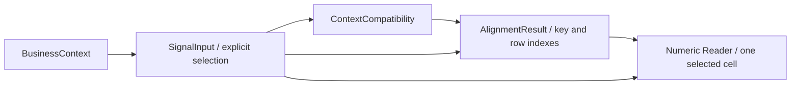

# Phase 3.1 Integration Audit Report

日期：2026-09-08。最终判断：**B. Small Fix Before Phase 3.2**。

确认 **1 个 P1 阻断项：P31E-AUD-01，Compatibility 回执没有完整绑定参与检查的 Policy、SignalInput 和关键回执语义**。换用部分不同 Policy、selection 或声明内容后，旧成功回执仍可使 Alignment 返回 `aligned`；对这些当前输入重新执行 Compatibility 则会拒绝。现有“调用方保持同一快照”的约定不足以满足本轮要求的严格入口检查。

其余相同快照下的链路与职责检查通过。专项及 backend **767/767** 测试通过，额外 **19/19** readiness 内联探针通过。没有发现 P0。本轮没有修改生产代码或测试，没有实施修复；仅新增本报告，探针结果及日志存放于仓库外。

## 1. Phase3.1 Layer Boundary Report

真实代码链路：



这条链路由本次只读探针调用现有 API 串联，尚无生产 Engine / Workflow 进行自动编排。

| 层 | 代码证据 | 审计结论 |
| --- | --- | --- |
| SignalInput | [models.py:271](D:/agent_study/askdata_studio/backend/app/querying/business_signals/models.py:271) | 持有捕获 Context、显式 selection、声明；对 Context 深拷贝，不自行证明业务资格 |
| Compatibility | [compatibility.py:747](D:/agent_study/askdata_studio/backend/app/querying/business_signals/compatibility.py:747) | 检查 metric / grain / key metadata / time / filter / declaration / unit / completeness / revision 的资格，不对齐业务键行 |
| Alignment | [alignment.py:335](D:/agent_study/askdata_studio/backend/app/querying/business_signals/alignment.py:335) | 从显式 key columns 建立行对应关系；对已知不通过的回执执行门禁，但完整快照绑定不足，见 P1 |
| Numeric Reader | [numeric.py:211](D:/agent_study/askdata_studio/backend/app/querying/business_signals/numeric.py:211) | 按 column ID 和 row index 安全读取一个 cell，证明数值可读性，不证明业务可比性或计算公式 |

Compatibility 复用 Numeric 的 column-level metadata helper，不调用 row 0 假装验证整列数值。Alignment 只复用 Context digest helper，不重跑 Compatibility；其 key 类型读取和广播结构检查属于本层职责。未发现业务公式提前进入上述执行模块。

## 2. Compatibility Alignment Contract Report

结论：**部分通过，但不满足严格入口要求；P31E-AUD-01 为 Phase 3.2 blocker。**

能够正确拒绝的只读实测：

| 修改 / 输入 | Alignment 结果 | pairs |
| --- | --- | --- |
| receipt.status=insufficient_evidence | insufficient_evidence / `COMPATIBILITY_NOT_APPROVED` | 0 |
| receipt.status=incompatible_context | incompatible_context / `COMPATIBILITY_NOT_APPROVED` | 0 |
| receipt.status=unsupported | unsupported / `COMPATIBILITY_NOT_APPROVED` | 0 |
| result_ids 改值 | incompatible_context / `COMPATIBILITY_RESULT_MISMATCH` | 0 |
| input_digests 改值或 Context 内容变化 | incompatible_context / `COMPATIBILITY_DIGEST_MISMATCH` | 0 |
| key_domains 改值 | incompatible_context / `COMPATIBILITY_KEY_DOMAIN_MISMATCH` | 0 |
| metric ref 的 metric_id / mapping_id 改值 | incompatible_context / `COMPATIBILITY_POLICY_REFERENCE_MISMATCH` | 0 |

**P31E-AUD-01 — [P1] 回执只绑定 Context 和部分引用，未绑定完整检查输入。**

根因定位：

- [compatibility.py:52](D:/agent_study/askdata_studio/backend/app/querying/business_signals/compatibility.py:52) 的 `context_digest` 只摘要 BusinessContext，不含 SignalSelection、声明内容或 Policy。
- [compatibility.py:806](D:/agent_study/askdata_studio/backend/app/querying/business_signals/compatibility.py:806) 返回的回执没有完整 Policy / SignalInput 快照绑定。
- [alignment.py:112](D:/agent_study/askdata_studio/backend/app/querying/business_signals/alignment.py:112) 只比较 metric 的 role / metric_id / mapping_id / match_status，以及声明的 ID / type / result_id / context_digest 引用。相同引用下的来源授权、信任规则、selection、claim 内容不受该检查约束。
- [alignment.py:221](D:/agent_study/askdata_studio/backend/app/querying/business_signals/alignment.py:221) 直接复制回执 periods；[alignment.py:326](D:/agent_study/askdata_studio/backend/app/querying/business_signals/alignment.py:326) 直接继承 operation。

以下均从**真实成功 Compatibility 回执**开始，再在内存中替换对象或字段；未修改仓库文件：

| 回执生成后的变更 | 旧回执进入 Alignment | 对当前输入重新检查 Compatibility / 实际影响 |
| --- | --- | --- |
| Policy current.allowed_sources 改为 gross_amount，同时使用新 policy_id / definition_digest | `aligned`，无 Issue | `incompatible_context` / `METRIC_SOURCE_MISMATCH` |
| Policy accepted_issuer_refs 改为另一 issuer | `aligned`，无 Issue | `insufficient_evidence` / `UNTRUSTED_DECLARATION` |
| 保持声明引用不变，将 current unit claim 从 CNY 改为 USD | `aligned`，无 Issue | `incompatible_context` / `UNIT_MISMATCH` |
| 将 current.metric_column_id 改为 key column | `aligned`，无 Issue | 当前 selection 未通过新的 Compatibility 检查 |
| composite fixture 中交换两侧 region / channel 的 key_column_ids | `aligned`、matched | 新检查为 `KEY_SOURCE_MISMATCH`；旧回执输出把 store/web 标成 region |
| metric ref 的 source_fields 或 relationship_id 改值 | `aligned`，无 Issue | 用户要求的“metric refs 被修改后拒绝”未完整实现 |
| receipt.operation 从 compare 改为 divide，Policy 仍只授权 compare | `aligned`，输出 operation=divide | 未获该 Policy 授权的 operation 被传递 |
| receipt.current period 改为 2030-01 至 2030-02 | `aligned` | 修改后的 period 被复制进 BusinessKey.periods |

最小复现，在 backend 目录使用现有 fixture 和 API：

```python
import sys
sys.path.insert(0, "tests")
from test_business_signal_alignment import fixture
from test_business_signal_compatibility import typed_policy, source
from app.querying.business_signals import compatibility, alignment

inputs, policy = fixture(), typed_policy()
receipt = compatibility.check_context_compatibility(
    inputs, policy, operation="compare"
)
raw = policy.model_dump(mode="python")
raw["policy_id"] = "revised-source-policy-v2"
raw["definition_digest"] = "revised-source-policy-content-v2"
raw["metric_rules"][0]["allowed_sources"] = [source("current", "gross_amount")]
changed_policy = type(policy).model_validate(raw)

assert alignment.align_context_keys(inputs, receipt, changed_policy).status == "aligned"
assert compatibility.check_context_compatibility(
    inputs, changed_policy, operation="compare"
).status == "incompatible_context"
```

这不是仅靠伪造摘要才能触发的情形：普通调用方替换为另一份有效构造的 Policy 或 selection 即可绕过旧回执所证明的资格。复合键例子会直接输出错误实体对应关系，因此按 P1 阻断下一阶段，而不是仅作为文档限制。

建议修复范围（本轮未实施）：由 Compatibility 产生版本化的完整 Policy 内容绑定、每个 SignalInput 的 Context + selection + 声明内容绑定，并覆盖回执关键语义字段；Alignment 在任何 key extraction 前验证这些绑定。不能仅相信调用方自填 definition_digest 或声明 ID，也不应在 Alignment 内复制 SQL / metric / time / filter 的判断逻辑。普通内容摘要用于防错用和过期输入，不等于签名或恶意伪造防护。

验收至少应覆盖本表的 Policy、selection、同 ID claim、metric ref、operation、period 变更，并验证拒绝时无 pairs。此建议只定义待修复边界，没有实现代码或新增测试。

## 3. Alignment Responsibility Report

[AlignmentResult / AlignmentPair / DuplicateKey](D:/agent_study/askdata_studio/backend/app/querying/business_signals/models.py:353) 仅携带 key、行号、pair 状态、缺失 / 重复证据、Issue，以及角色 / operation / broadcast 等关系元数据。

输出字段中没有 metric value、growth、ratio、percentage 或公式结果。`broadcastable` 是 total 结构资格，不是贡献率；`operation=divide` 是元数据，不触发除法。模块中没有 S1/S2/S3 业务计算或 BusinessSignal 生成。

重复 bucket 保留全部 row_indexes 和 raw_keys；代表 key 只标识 bucket，重复侧 pair 不选择行。左右原始值分别保留在 left_key / right_key 中。职责范围通过，回执 period / operation 的完整性例外归入 P31E-AUD-01。

## 4. Numeric Boundary Report

串联实测使用以下既有入口，没有增加接入代码：

```python
read_numeric_value(
    inputs[role].context,
    inputs[role].selection.metric_column_id,
    pair_row_index,
    policy.numeric_rules,
)
```

[numeric.py:169](D:/agent_study/askdata_studio/backend/app/querying/business_signals/numeric.py:169) 通过 column ID 查 ColumnMetadata，并核对唯一 ID、ordinal 与位置；随后读取 `rows[row_index][ordinal]`。不使用 `row["sales_amount"]`、output_name 或 alias 匹配。

重复显示名探针仍按正确 column ID 读取。行索引、类型、行宽、codec、fidelity、非有限值、精度 / scale / 范围及 NumericRules 检查保持有效。SQL NULL 返回 `SQL_NULL`，work_value 为 None，不变成零。

Numeric 的 `ready` 只表示该 cell 在给定 NumericRules 下可安全读取；不代表单位或业务关系已被证明。探针没有自动装配 unit / evidence 标签，没有计算 attainment、change 或 contribution。该职责边界通过，但未来调用方必须先获得有效绑定的上游资格与行对应结果。

## 5. S1 Readiness Report

显式构造的 actual / target Context 使用受信 fixture 声明，通过真实 API 验证：

| 项目 | actual | target |
| --- | --- | --- |
| metric source | paid_amount | target_amount |
| aggregation | SUM | SUM |
| grain / key | region | region |
| 原始时间 | 2026-08 完整 date 半开月 | target_month=2026-08 |
| 规范期间 | 2026-08-01 至 2026-09-01，左闭右开 | 同一获准月份 |

unit、time domain、population、row selection、revision 以及 target basis / source uniqueness 均由 fixture 显式提供。Compatibility=compatible；两个地区均 matched，Alignment=aligned。

两侧故意使用不同的行顺序，得到原始 row pairs `(0,1)`、`(1,0)`；对应 Numeric 读取均为 ready。实际读取值包含 125.75、0.00 和目标 150.00、200.00；这些只是捕获输入，没有进行目标达成率计算。

结论：同一获批快照下的 S1 输入条件可满足。该结论不豁免 P31E-AUD-01。

## 6. S2 Readiness Report

current / baseline 均映射到授权 actual_paid_sales / paid_amount，使用 SUM、region grain、相同获准非时间过滤；current 为 2026-08 完整月，baseline 为 2026-07 完整月。

真实链路达到 compatible → aligned → Numeric ready；右侧逆序时仍用实际 row_index 1 / 0 读取正确 cell。

| 场景 | 实测 |
| --- | --- |
| 完整相同 region 集合 | matched，数值可读 |
| 左侧多 region | missing_right，右 row_index=None，整体 insufficient_evidence |
| 右侧多 region | missing_left，左 row_index=None，整体 insufficient_evidence |
| 两侧重复 region | incompatible_context / DUPLICATE_KEY；保留每侧 `[0,1]`，不选择首行 |
| baseline 改为未授权 order_amount | Compatibility 拒绝 / METRIC_SOURCE_MISMATCH，Alignment 无 pairs |
| baseline 改为非相邻月份 | Compatibility 拒绝 / TIME_PERIOD_MISMATCH，Alignment 无 pairs |

没有 missing 补零或 change_rate / absolute_change 计算。同一快照下 S2 readiness 通过。

## 7. S3 Readiness Report

parts 使用 category grain / product-category key domain；total 使用 global aggregate、无 key selection、恰好一行。两侧指标及 bounded period 经真实 Compatibility 认可，Policy 明确允许 allow_global_total。

获准场景的 row pairs 为 `(0,0)`、`(1,0)`，broadcastable=True。parts 的两个已知 key 均可引用同一 total 行，Numeric 安全读取 total 的 900.00；没有计算占比。

真实链路拒绝情况：

| total 情况 | 拒绝证据 |
| --- | --- |
| 多行 | GLOBAL_ROW_COUNT |
| 带 key selection | KEY_SELECTION_MISMATCH / METRIC_KEY_OVERLAP |
| Policy 未授权广播 | KEY_BROADCAST_NOT_AUTHORIZED |
| 实际 grouped grain | GRAIN_MISMATCH |

上述拒绝均在 Compatibility 生效，Alignment 门禁保持拒绝，无 pairs 或广播。S3 输入结构 readiness 通过，不构成 Product Contribution 实现。

## 8. Safety Boundary Report

| 安全要求 | 审计结果 |
| --- | --- |
| Missing 不能转 0 | 缺失侧 row_index=None，missing lists 保留；不存在默认 metric 值 |
| Duplicate 不能取第一条 | 全部 row_indexes 保留；重复侧 pair index=None，状态 ambiguous |
| Unknown 不能升级为 missing | NULL / 未映射 key 令该侧索引不完整；对侧未匹配项保持 unresolved，确定 missing lists 不包含它 |
| Unresolved 不能升级为 matched | 未建立双侧唯一对应时不输出 matched |
| NULL metric 不能转 0 | Compatibility / Alignment 可以通过，Numeric 明确返回 insufficient_evidence / SQL_NULL |
| 已观测数值 0 与缺失有区别 | 原始 0.00 可以作为 observed 数值安全读取，未从缺失制造 |

这些结论由现有 Alignment / Numeric 测试及新增只读串联探针共同验证。没有公式执行，因此也没有为了计算而绕过上述状态。

## 9. Determinism Report

对 S1、S2、S3 分别执行 A→A、A→B→A，比较完整 Compatibility、Alignment 和 Numeric 读取结果；均保持稳定。调用前后 SignalInput、Context、rows、Policy 和声明内容未改变。

AST 与代码调用检查显示，Phase 3.1 执行模块没有 SQL 执行器、数据库 client、LLM、网络、当前时间或随机 ID 获取。Compatibility 的手工 Gregorian 字面值校验不读取时钟；hashlib 内容摘要是确定性内容绑定，不是随机 Signal ID。

Alignment 没有重新调用 Compatibility 或 Numeric Reader。Numeric 使用显式局部 Decimal context，读取行为不依赖环境精度设置。既有测试还覆盖角色字典顺序、行顺序与深拷贝隔离。

证据：[静态边界清单](<C:/Users/Wang Hongbo/.codex/visualizations/2026/09/07/01a07c06-45b4-7451-854d-0a060836bcda/phase31e/static-boundaries.json>)、[19 项 readiness 探针](<C:/Users/Wang Hongbo/.codex/visualizations/2026/09/07/01a07c06-45b4-7451-854d-0a060836bcda/phase31e/readiness-probes.json>)。

确定性通过不代表输入绑定充分；错误地接受另一 Policy 也可能是确定性的，这两类性质分别判断。

## 10. Phase Boundary Report

相对 HEAD `77c1aba97c2a99571a290bd018f6dcfcd5c35d3c`，已跟踪 backend/app 与 frontend/src 无修改；ResultContract、BusinessContext 语义、Phase 2 SQL 理解保持原样。工作区 Phase 3 源码和旧报告此前已是未跟踪文件，本轮没有将它们暂存或提交。

扫描 backend/app 的 Phase 3 模块以外源码，未发现对 business_signals 的引用；本轮没有 Workflow / 请求路径接入。Phase 3 消费已有 BusinessContext，没有反向补写其语义。

对 backend/app、backend/tests、frontend/src 及已有 Phase 3 报告的 107 个文件进行哈希复核，未发生变化；依赖目录不纳入该源码清单。本轮仓库内只新增本审计报告，没有新增测试或修改代码。

未实现 S1/S2/S3 公式、BusinessSignal 计算、SignalEvidence 自动装配、SignalBatch、Engine 或 Workflow 接入。

## 11. Test Regression Report

在 backend 目录，按附件指定顺序运行项目 `.venv\Scripts\python.exe -B`：

| 顺序 | unittest discover 参数 | 结果 |
| --- | --- | --- |
| 1 | `-s tests -p test_business_signal_alignment.py` | **73/73**，0.497s，OK |
| 2 | `-s tests -p test_business_signal_compatibility.py` | **120/120**，0.476s，OK |
| 3 | `-s tests -p test_business_signal_numeric.py` | **67/67**，0.013s，OK |
| 4 | `-s tests -p test_business_signal_models.py` | **33/33**，0.012s，OK |
| 5 | `-s tests -p test_business_signal_policies.py` | **24/24**，0.009s，OK |
| 6 | `-s tests` | **767/767**，20.316s，OK |

完整命令形式：`.\.venv\Scripts\python.exe -B -m unittest discover ...`。全部进程退出码为 0，原有 767 项基线无回归。

额外 19 项 readiness 探针直接调用现有生产 API；入口契约的正反例通过内存变更验证，没有加入测试文件，因而不计入 767 项。现有测试全绿不能覆盖或消除本轮复现的 P1。

证据：[backend 全量日志](<C:/Users/Wang Hongbo/.codex/visualizations/2026/09/07/01a07c06-45b4-7451-854d-0a060836bcda/phase31e/backend-tests.log>)、[主审独立复现记录](<C:/Users/Wang Hongbo/.codex/visualizations/2026/09/07/01a07c06-45b4-7451-854d-0a060836bcda/phase31e/receipt-reproductions.json>)。

## 12. Final Decision

**B. Small Fix Before Phase 3.2**

| Approve 条件 | 判断 |
| --- | --- |
| Compatibility 严格控制 Alignment 入口 | **未满足：P31E-AUD-01** |
| Alignment 只产生 row / key 关系 | 通过 |
| Numeric 只负责安全读取 | 通过 |
| S1/S2/S3 输入条件均可满足 | 同一获批快照下通过 |
| 无业务公式提前泄漏 | 通过 |
| 无 missing 补 0 | 通过 |
| 无 duplicate 取首行 | 通过 |
| 无跨 Context 事实猜测 | 常规链路未发现推断补造；回执语义错配仍受 P1 阻断 |
| 所有测试通过 | 通过，767/767 |
| 没有 P0/P1 | **未满足：1 个已确认 P1，未发现 P0** |

Phase 3.1 已具备可工作的分层输入链路，但在补齐回执与完整输入快照的绑定前，不能批准其作为严格可信的 Phase 3.2 计算输入层。本轮遵守禁止修改代码的要求，P31E-AUD-01 尚未修复。
