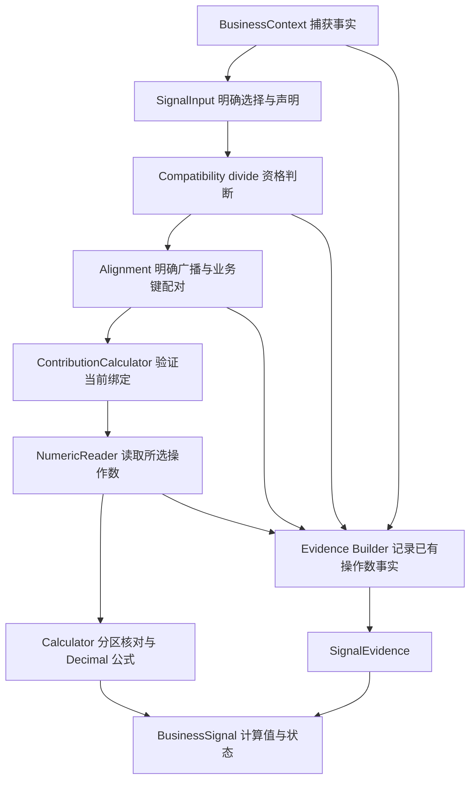

# Phase 3.4.5 S3 Audit Report

**最终结论：A. Approve Phase 3.5**

本轮对当前 S3 Product Contribution 工作区快照进行只读审计，未发现新的 P0/P1。Metric、Grain、Broadcast、Completeness、Partition reconciliation、Numeric、Evidence 和失败处理满足当前两个 V1 Sales Contribution profile 的要求。backend 重新运行 **1082/1082 全部通过**。

没有修改生产代码或测试；没有实现 SignalBatch、Engine、Workflow。本结论批准进入下一阶段，不表示已经实现 Phase 3.5。

## 1. S3 Architecture Report

职责边界通过：

- BusinessContext 保存上游解析和执行事实，SignalInput 明确选择 metric/key/auxiliary columns 与声明。
- Compatibility 判断来源、聚合、grain、期间、过滤、单位、完整性和 revision 资格。
- Alignment 在 receipt 绑定通过后提取业务键并产生显式 total 广播配对。
- Calculator 验证当前输入、Policy、receipt、Alignment 的绑定，不重新运行 Compatibility 或 Alignment；然后读取 Numeric、核对分区并计算。
- Evidence Builder 只装配已经提供的事实，不重新读取 rows、Numeric 或 SQL，不计算比例。

源码依据：[Calculator 入口](D:/agent_study/askdata_studio/backend/app/querying/business_signals/product_contribution.py:206)、[Numeric Reader](D:/agent_study/askdata_studio/backend/app/querying/business_signals/numeric.py:211)、[Evidence Builder](D:/agent_study/askdata_studio/backend/app/querying/business_signals/evidence.py:25)。静态调用检查和运行时探针均未发现职责越界。

## 2. Metric Report

通过。parts 与 total 均要求同一获准 database 中的 `SUM(orders_current.paid_amount)`，业务语义为 actual_paid_sales。实际列通过 selection.metric_column_id 选择，来源使用完整 database/table/field 身份，聚合使用实际 ColumnSemantic.aggregation。

本轮新反例确认：同 output_name 的错误来源、异库同名字段、AVG、COUNT、缺失聚合均拒绝。同源只改 alias 仍可计算，说明 alias 不授予或取消 metric 资格。

另将实际 Policy 改为 order_amount、profit、margin 等口径，重新计算真实内容 digest，并通过公共 producer 得到新的 compatible/aligned 结果；S3 仍返回 UNSUPPORTED_PRODUCT_CONTRIBUTION_POLICY，Numeric 读取为 0。不是仅靠旧 receipt 失效来拒绝越界。

[固定 Policy 内容门禁](D:/agent_study/askdata_studio/backend/app/querying/business_signals/product_contribution_policy.py:204)只允许 category_sales_contribution_v1、product_sales_contribution_v1 的实际定义，不能凭相同 policy_id 或调用方填写的 digest 扩大业务范围。

## 3. Grain Report

通过。支持的 parts grain 为单一 category 或 integer product_id，total 为 global_aggregate，grouping_columns=[]。

实际 grouped total、混合 category/product 粒度、parts 改成 customer/region、total 带 key selection 均拒绝。真实整数 product_id 乱序案例正确保留类型与行位置，没有转换为字符串类别或重新聚合。

[Compatibility 的 grain 检查](D:/agent_study/askdata_studio/backend/app/querying/business_signals/compatibility.py:287)比较已解析 query_grain 和 grouping source 身份；Schema role 或显示名称不能替代这些事实。Calculator 不推断 grain。

## 4. Broadcast Report

通过。正常 global total 同时满足一行、无 key、Policy 明确授权广播；producer 产生 matched pair，broadcast=True、right_row_index=0、right_key=None。Calculator 再验证绑定、配对数量、parts 行覆盖和广播一致性。

total 多行、total 带 key、grouped total、单行但未授权广播均未产生 computed。修改旧 Alignment 的 broadcast 或给 total 注入 parts key 会导致绑定失配，在 Numeric 前拒绝。

total Evidence 保持 business_key=None、key_values=[]、key_columns={}、row_index=0、alignment_broadcast=True。多个 parts 的 total Evidence 内容相同，但对象和嵌套容器独立；不会把某个 category/product_id 变成 total 的业务键。

源码依据：[广播 producer](D:/agent_study/askdata_studio/backend/app/querying/business_signals/alignment.py:253)、[Calculator 配对形状](D:/agent_study/askdata_studio/backend/app/querying/business_signals/product_contribution.py:94)、[Builder 广播一致性检查](D:/agent_study/askdata_studio/backend/app/querying/business_signals/evidence.py:97)。

当前两个获准 S3 profile 的真实正常链路都是广播配对。普通非广播 matched 的局部形状支持不等于已经验证了真实 producer 的非广播 S3 业务链路；本轮没有伪造并重签成功 receipt。

## 5. Completeness Report

通过。分母资格包含：complete_query_output、truncated=False、已知且相等的输出计数、row_selection absent、population complete、同一 dataset/revision；parts 另需所选 key domain 的完整分区声明。

本轮验证：

| 反例 | 结果 |
| --- | --- |
| 单行完整 total 声明 LIMIT 1 / TopN，或 parts TopN | ROW_SELECTION_PRESENT，拒绝 |
| truncated / 已知 incomplete population | incompatible_context |
| 缺 row_selection、population、revision 或完整性计数未知 | insufficient_evidence |
| parts 缺完整 partition domain 证明 | PARTITION_COVERAGE_UNKNOWN |
| revision 不同，或 provenance.snapshot_ref 与声明矛盾 | REVISION_CONFLICT |
| 时间范围、开闭性、支付过滤、单位或 scale 不同 | 拒绝，不转换或猜测 |

S3 要求两个输入处于相同显式有界期间；相同非整月期间正常通过，这是 S3 的既定范围，不套用 S2 的相邻整月规则。

本轮还用重新生成 digest 和 receipt 的放宽 population/truncation/revision/unit/time Policy 测试了固定范围门禁，均在读取数值前被 S3 拒绝。数值恰好相等不能替代声明资格。[完整性检查](D:/agent_study/askdata_studio/backend/app/querying/business_signals/compatibility.py:571)。

## 6. Reconciliation Report

通过。所有操作数先由 Numeric Reader 返回 ready，再对完整分区核对 `sum(parts)` 与独立 total；任一操作数失败即阻止整个分区计算。

- exact：残差必须严格为零；极小非零残差也拒绝。
- relative_tolerance：仅在 Policy 显式启用时使用 `abs(total) * Decimal('1e-12')`；阈值等号接受，最小步超过阈值拒绝。
- 允许 approximate 来源不自动启用容差。
- exact 下 part>total 拒绝；显式容差下允许的微小超额按真实比例输出，不截为 1。
- 不添加隐藏 epsilon，不调整最后一个 part 来强迫比例和等于 1。

累加、残差和阈值比较都在独立 Decimal Context 内。输入最多 10000 项，现有数量级和 scale 限制下，累加有效数字不超过 60 位，低于 80 位工作精度；仍有 Inexact 防御检查。

另用真实 Reader 的结果进行了 10000 项数值核对：`9999 × 9e37 + 1e-18` 对 `9e37` 精确拒绝为 PARTITION_TOTAL_MISMATCH；`10000 × 1e-18` 对 `1e-14` 为 ready，单项比例为 0.000100000000。没有把中间累计和套入单项输入上限。[分区核对](D:/agent_study/askdata_studio/backend/app/querying/business_signals/product_contribution.py:48)。

## 7. Formula Report

通过。唯一公式是 `contribution_rate = part / total`，使用 NumericReadResult.work_value 的 Decimal，不使用 float 公式。

工作精度 80，输出 scale 12，ROUND_HALF_EVEN，局部 Context 的指数范围、flags、traps 显式设置。没有继承或修改调用方的全局 Decimal 状态。

本轮数值主矩阵核对了 191 个输出比例，使用 Fraction 和整数实现的独立 HALF_EVEN oracle；覆盖 18 位小数的舍入中点两侧、极大值、极小非零 total 和全部获准 max_input_scale 0–18 / max_abs_exponent 1–38。结果一致。

原始来源精确性与运算舍入分别保留，非终止比例可以来源 exact、运算 rounded。[比例实现](D:/agent_study/askdata_studio/backend/app/querying/business_signals/product_contribution.py:75)。

## 8. Zero Total Report

通过，使用实际零值判断，没有 epsilon 分母替代。

| 输入 | 结果 |
| --- | --- |
| 完整分区全部 0，total=0 | undefined，ZERO_TOTAL，无比例 |
| total=0，任一 part>0 | incompatible_context，ZERO_TOTAL_WITH_POSITIVE_PART，整个分区无比例 |
| total>0，某 part=0，分区核对通过 | 该项 contribution_rate=0.000000000000 |
| 极小非零 total | 仍作为非零 Decimal 处理 |

零、负零和带巨大指数的零均经过补充探针。没有 Infinity、NaN、默认比例或负数取绝对值；负数按 NumericRules 拒绝。

## 9. Numeric Report

通过。total 读取一次，每个 part 一次；值由 selected metric_column_id 和 Alignment 行索引交给 Numeric Reader 定位。Calculator 与 Evidence Builder 均不直接访问 rows 取数。

本轮 187 次完整公共链路主矩阵记录 463 次 Reader 调用、576 次 Evidence Builder 装配；另有两个巨大指数正负零的完整链路补充。探针确认原始 Reader 对象进入核对、公式和 Evidence，未被修改或重新读取。

Decimal 保留 exact，显式允许的 DOUBLE 保留 approximate；approximate 不被 Evidence 或 Decimal 格式升级为 exact。NULL 保留 sql_null 与真实 row；reject 保留 raw_value、品质与问题。混合失败遵守既有阻断优先级，不让 zero total 掩盖不可读取输入。

max_parts 的真实 producer 边界也已验证：10000 项通过入口，探针在 compute_partition 入口主动停止；10001 项以 MAX_PARTS_EXCEEDED 在零 Numeric 读取时拒绝。此项不声称完成了 10000 个 Signal/Evidence 输出的压力测试；它与上一节独立 10000 项累加检查分别记录。

## 10. Evidence Report

通过。独立抽查三项 category 错序、integer product_id 乱序、metric ordinal 调整、显式 provenance 和上游限制等成功案例。每个 computed 输出均有两个有效操作数依据及 contribution_rate / 1 的公式关联。

| 项目 | parts Evidence | total Evidence |
| --- | --- | --- |
| evidence_id | parts:metric | total:metric |
| result_id / context_digest | 当前 parts 身份 | 当前 total 身份 |
| column_id / ordinal | 当前所选 metric 列 | 当前所选 metric 列 |
| row_index | 原始 parts 行位置 | 0 |
| business_key | 该侧 category/product_id key | None |
| alignment_broadcast | True，表示所在 pair 使用 total 广播 | True |
| value / numeric_quality | 实际 Reader 观察 | 同一次 total Reader 观察 |
| metric / aggregation / grain / time / filters / unit | 当前输入与已验证 receipt 的事实 | 当前输入与已验证 receipt 的事实 |
| formula_refs | contribution_rate / 1 | contribution_rate / 1 |

BusinessSignal 的 current/reference observation 和 computed_value.input_evidence_ids 正确关联这两份 Evidence。Policy ID/version/digest 保存在 Signal，Evidence 不重复计算公式、不保存 computed_value。未发现“有结果但缺输入依据”。

独立 Evidence 矩阵共 24 个案例，生成 38 个输出、76 条 Evidence，其中 10 个 computed Signal 全部满足上述要求；所有输出 JSON roundtrip 通过。[Evidence 接线](D:/agent_study/askdata_studio/backend/app/querying/business_signals/product_contribution.py:164)。

## 11. Failure Safety Report

通过。missing、duplicate、receipt mismatch、Alignment mismatch、NULL、Numeric reject、coverage failure、partition mismatch 均未产生错误 computed。

- 未通过全局资格时，不读取 Numeric，不核对或求比例。
- 缺失/未知结果不假定存在 row 0；未验证 Alignment 不提供 row、业务键或广播事实。
- duplicate/ambiguous 不取第一条，不在 Calculator 自动合并。
- NULL 保留真实行的空值；Numeric reject 保留拒绝原因和实际 raw_value，不把两者改成零。
- 任一 part 不可读或分区不一致，所有贡献率停止计算。

根审计另执行 13 个 stale-binding 反例，分别改动 parts rows、total 值、metric/key/auxiliary selection、声明内容、Policy 声明 digest/实际内容、receipt operation/status/semantics、Alignment 广播或 binding。全部 incompatible_context，Numeric 与 ratio 调用为 0；失败 Evidence 无旧 row/key 或未验证 normalized facts。

因此没有补零、默认 total、选择首条或按显示名称猜测。

## 12. Determinism Report

通过。A→A、A→B→A、相同内容重新构造均得到一致结果，配对依据业务键而非行顺序。调用后 Context、SignalInput、Policy、receipt、AlignmentResult、NumericResult 均不变。

四组带极低 precision、受限指数范围、已设置 flags 和 traps 的调用方 Decimal Context 未影响结果，也没有被修改。total Evidence 跨 Signal 内容一致但深层容器隔离，修改输出不污染输入或其他输出。

静态与运行时检查未发现 random、uuid、clock 依赖。signal_id 仍保持当前未生成策略。

## 13. Boundary Report

通过。S3 只计算获准的 sales contribution，不输出 profit、margin、risk、alert、recommendation 或 LLM 解释。Approximate/rounding 等 Issue 是计算限制说明，不是业务告警。

Calculator 没有 Agent 规划、SQL 生成/执行、数据库访问、LLM 或 Workflow 调用；Evidence Builder 无 acquisition、公式或上游重跑。当前没有在 business_signals 模块外发现 S3 Calculator 的 Workflow/Engine 入口。

本轮只读验证，没有实现 SignalBatch、Engine、Workflow。

## 14. Regression Report

本轮重新执行全部指定测试，使用 backend 现有 `.venv/Scripts/python.exe` 与 unittest。

| 测试组 | 结果 |
| --- | --- |
| S3 Calculator | 72/72 |
| S3 Evidence | 22/22 |
| S1 | 66/66 |
| S2 | 73/73 |
| 通用 Evidence | 47/47 |
| Business Signal 基础层 | 352/352 |
| Business Signal 合计 | **632/632** |
| backend full | **1082/1082** |

分组执行各测试模块，完整 Business Signal 数量为上述子组之和。全量命令：`python -m unittest discover -s tests -q`，工作目录 backend，用时 20.287 秒，零失败、零跳过。独立审计探针不计入 1082 项，也没有新增或修改测试代码。

本轮审计前后 110 个既有源码文件的 SHA-256 完全一致；报告创建前 git status 也完全一致。唯一仓库新增文件为本审计报告。当前 HEAD 为 `77c1aba97c2a99571a290bd018f6dcfcd5c35d3c`；原有未跟踪的 Phase 3 文件也已纳入源码快照核验。本结论对应当前工作区版本，不声称已提交、打 tag 或生成发布版本。

## 15. Final Decision

**A. Approve Phase 3.5**

| Approve 条件 | 审计结论 |
| --- | --- |
| Metric 正确 | 通过 |
| Broadcast 正确 | 通过 |
| Completeness 正确 | 通过 |
| Partition reconciliation 正确 | 通过 |
| Numeric 安全 | 通过 |
| Evidence 完整 | 通过 |
| Failure 安全 | 通过 |
| 无业务越权 | 通过 |
| 全部测试通过 | 1082/1082 |

未发现新的 P0/P1，当前 S3 Calculator 与 Evidence 可作为进入 Phase 3.5 的冻结工作区基线。

保留既有边界：资格依赖获准的捕获事实与声明；内容摘要用于防止旧 receipt 错误复用，不是签名或恶意伪造防护。Evidence Builder 接收调用方实际读取的 NumericResult，不自行认证来源。不存在预期产品全集时不制造缺失产品；比例独立舍入，不承诺显示值之和严格等于 1。这些属于当前明确设计范围，不是本轮新增阻断。

**本轮没有修改代码，没有实现 SignalBatch、Engine 或 Workflow。**
