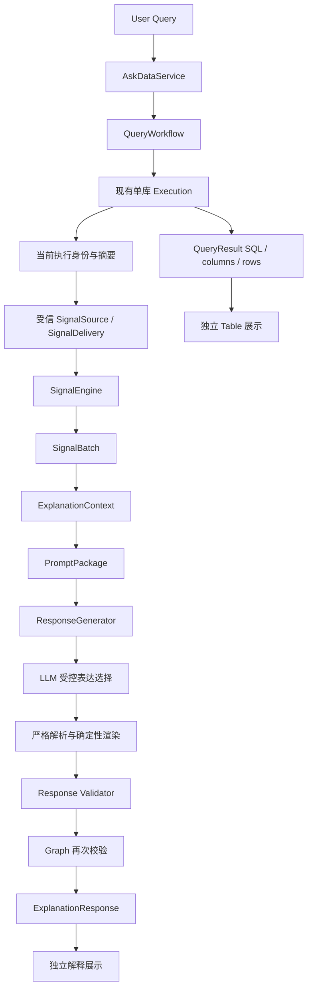

# Phase 4 Final Audit Report

审计阶段：Phase 4.5。审计日期：2026-09-09（Asia/Shanghai）。

**最终结论：A. Freeze Phase 4。**

在此前明确接受的“受信 BusinessSignal 交付入口”范围内，Business Signal Layer 与 Explanation Layer 可以冻结。本次未发现新的 P0/P1 阻断项。Explanation **145/145**、Business Signal **654/654**、Workflow/Service **70/70**、backend **1249/1249** 全部通过。

本结论针对当前工作区代码快照。正式 Graph 确已连接，但默认 API 尚未配置 SignalSource；普通查询没有已计算 Signal 时保留表格并返回解释不可用。本次没有将自动选择 S1/S2/S3 输入、Policy、声明及自动生产 Signal 宣称为已实现能力。这延续 Phase 4.3.2 已确认的接线范围。

本轮只读审计，没有修改或新增生产代码、测试代码；仅新增本报告。没有提交、暂存或创建 tag。

## 1. End-to-End Architecture Report

### 实际生产连接



| 连接 | 代码证据与实测 |
| --- | --- |
| Service → Workflow | [askdata_service.py](D:/agent_study/askdata_studio/backend/app/services/askdata_service.py:29) 接受并传入 `signal_source`；Service 构造入口测试通过。 |
| Workflow → Execution | [query_graph.py](D:/agent_study/askdata_studio/backend/app/workflows/query_graph.py:76) 定义真实编译 Graph；执行成功才进入信号节点，失败直接结束。 |
| Execution → Signal Delivery | [query_graph.py](D:/agent_study/askdata_studio/backend/app/workflows/query_graph.py:237) 构造当前请求；向 source 传入执行身份与摘要，不传表格作为解释输入。 |
| Delivery → BusinessSignal | [signal_delivery.py](D:/agent_study/askdata_studio/backend/app/workflows/signal_delivery.py:114) 验证完整 request 一致、结构及当前执行引用，返回分离后的 Signal。 |
| SignalEngine → SignalBatch | Graph 调用现有 `SignalEngine.build(signals)`，严格恢复 batch；没有计算公式或重新选择业务输入。 |
| Batch → Context → Prompt | [query_graph.py](D:/agent_study/askdata_studio/backend/app/workflows/query_graph.py:281) 调用真实的两个 Builder；并非测试专用的旁路。 |
| Prompt → Generator → Validator | [response_generator.py](D:/agent_study/askdata_studio/backend/app/querying/response_generator.py:24) 只接收当前 PromptPackage，严格处理原始模型回复，校验后返回。 |
| Validator → Graph → API result | [query_graph.py](D:/agent_study/askdata_studio/backend/app/workflows/query_graph.py:293) 再次校验 Generator 返回值，随后附加到独立 Table result。 |

`data_qa` 路径从 `answer_qa` 进入同一信号链，不伪造一次 SQL 执行。当前多库执行本来尚未启用，返回明确执行不可用。

测试使用真实 Graph、Service 注入、SignalEngine、Builders、Adapter、Renderer 和 Validator；获取数据及模型传输采用测试替身。S1/S2/S3 测试信号由真实 Calculator 根据固定测试 Context 产生。本审计没有进行线上模型调用或部署环境验收。

### 当前快照门禁

- 新请求清空 `execution_result`、`signal_batch`、`prompt_package`、`explanation_response` 及旧解释交付字段。
- Delivery 绑定 task、query、session、user、route；数据库路径另绑定 result_id 和执行摘要。
- 有 Evidence 的 computed/undefined Signal 必须引用本次执行；缺失或非法 Evidence 不能因状态标签而扩大 Engine 展示资格。
- 执行摘要用于防止错误复用，不是签名，也不独立证明 source 提供的业务事实。SignalSource 的输入选择、资格与权限责任仍属于受信上游。

## 2. Signal Boundary Report

**通过。** [context_builder.py](D:/agent_study/askdata_studio/backend/app/querying/explanation/context_builder.py:125) 从 SignalBatch 逐字段投影，后续模块只消费分离的 Explanation 模型。

Explanation 不重新访问 SqlExecution、SQL rows、BusinessContext 或 ResultContract 对象；不调用 Calculator、Compatibility、Alignment、Numeric Reader 或 Evidence Builder。引用中的 `result_contract_version` 是已有身份字符串，并不表示读取 ResultContract。

SignalEngine 保留原状态、稳定顺序、展示资格与 Evidence 关系。computed 与 undefined 才可能进入事实区；insufficient_evidence、incompatible_context、unsupported 仅产生受控 notice 和 omission。被 Engine 隐藏的 computed Signal 也不会被 Explanation 重新提升为可展示事实。

S2 的 undefined 状态按输出保留：absolute_change 可以仍为 computed，change_rate 仍为 undefined；Explanation 不重新执行减法或除法，不补零。

## 3. Prompt Safety Report

**通过。** [prompt_builder.py](D:/agent_study/askdata_studio/backend/app/querying/explanation/prompt_builder.py:167) 强制系统消息来自固定词典，用户消息严格等于当前事实、引用及展示元数据的 canonical JSON。

| 区域 | 允许内容 | 审计结论 |
| --- | --- | --- |
| facts | 已计算输出的字符串 value、unit、状态、公式引用、Policy 身份、业务键及必要限制引用 | 不换算百分比、不舍入、不判断增长、达标或原因。 |
| controlled variants | S1/S2/S3 对应固定 variant；模型只能选择 `summary` 或 `operands` | 不接受任意模板、自由结论或模型撰写的数值。 |
| Evidence summaries | Signal 作用域引用、result/context/column/row 身份、已有观察值与质量、单位尺度、规范期间/过滤条件、公式、广播标记 | 不展开完整 Evidence、声明原文或 schema。 |
| notices / omissions | 白名单 code、固定解释、展示范围与预算导致的遗漏 | 未知上游限制归入受控占位 code，不复制自由文本。 |
| question / string data | 用户问题、业务键、标识符及规范过滤值 | 始终作为数据；问题不选择 metric，不改变事实和 Signal 资格。 |

读取守卫和最终 Prompt 检查均通过：没有读取或投影 BusinessSignal 的自由 message/description、Evidence 的 raw_value/provenance/schema_binding/source_fields、Issue.message/details；没有从执行或历史状态携入 SQL、rows、raw schema 或旧 analysis。

此处禁止的是执行/历史原始载荷进入解释事实。用户问题或合法字符串中出现类似 SQL、指令的字面文本，仍只是转义数据；不声称字符串中永远不会出现这些单词。业务键、filter 文字、问题均不能改变系统消息，也不能通过受控输出合同增加自由事实。

分页只保留完整 Signal/双操作数 Evidence 组合；预算不足时移除尾部完整组合并记录 omission，不截断一半公式或丢失必要 Evidence。分页不代表 TopN 或总体覆盖。

## 4. Validator Effectiveness Report

**通过。** [validator.py](D:/agent_study/askdata_studio/backend/app/querying/explanation/validator.py:171) 先检查原始对象树及严格模型，再与当前包进行完整比较。

| 对抗输入 | 结果与原因 |
| --- | --- |
| 改数字、百分比、精度文本或单位 | 拒绝。value 按当前字符串精确一致比较，不做等值换算；unit 必须相同。 |
| 新增、遗漏、重复、修改 Signal 引用 | 拒绝。范围和顺序必须属于当前包。 |
| 修改 formula_id / formula_version / 公式集合 | 拒绝。逐输出引用及整个 FactBlock 必须一致。 |
| 不存在 Evidence、观察值或行/列位置错配 | 拒绝。完整 citation 必须与当前摘要一致。 |
| 相同 evidence_id 跨 Signal 借用 | 拒绝。引用以 Signal 作用域加 Evidence ID 匹配，不能只按裸 ID 匹配。 |
| S3 total 借用 part key、改变广播语义 | 拒绝。Evidence 完整比较保留 total 的 key=None 和广播标记。 |
| undefined 改 computed=0、默认增长/完成结论 | 拒绝。状态、reason、value 及受控表达均受限。 |
| 新增自由业务事实、unsupported variant 或自由 text | 拒绝。Adapter 限定输出选择，响应 text 必须等于受控 Renderer 结果。 |
| 修改 Policy、period、quality、aggregation、limitations | 拒绝。完整 FactBlock/citation/notices 比较覆盖这些字段。 |
| 重复 JSON key、未知字段、隐藏字段、循环或过深回复 | 拒绝，不修补成可展示回答。 |

除了已有 Validator **33 项测试**，独立审计运行了 **20 个额外内存负例，全部拒绝**，包括自身结构合法、重新渲染后看似自洽的外来事实快照。另有 2 个注入数据正例通过：只允许将恶意字面量作为数据保留，事实不变。额外探针不新增仓库测试，也不计入 1249 基线。

Validator 的 `validated` 表示当前输入合同一致，不表示 Signal 计算成功。合法不可用响应可保留其 unavailable/failed 状态通过合同检查。Validator 不判断自由自然语言的真假，也不重新证明上游业务资格。

## 5. Evidence Completeness Report

对真实 Calculator 生成的固定样本执行 Engine → Context → Prompt → Response → Validator，检查 4 个 Signal、8 个作用域 Evidence 引用：

| Signal index | 类型及现有输出 | 操作数追溯 |
| --- | --- | --- |
| 0 | S1 attainment_rate=`0.500000000000` | actual：`captured-s1-actual / col_m / row 0`；target：`captured-s1-target / col_m / row 0`。 |
| 1 | S2 absolute_change=`50.00`；change_rate=`0.500000000000` | current：`captured-s2-current / col_m / row 0`；baseline：`captured-s2-baseline / col_m / row 0`。 |
| 2 | S3 contribution_rate=`0.400000000000` | parts：`captured-s3-parts / col_m / row 0`；total：`captured-s3-total / col_m / row 0`。 |
| 3 | S3 contribution_rate=`0.600000000000` | parts：`captured-s3-parts / col_m / row 1`；total：`captured-s3-total / col_m / row 0`。 |

每个输出均保留自己的两个 Evidence 引用；观察值、numeric quality、formula version 和上下文身份贯通。两个 S3 Signal 共享同一 total 来源，但引用不丢失 Signal 作用域，total 的 business_key 保持 None。上述数值来自既有输出，审计投影过程未计算公式。

详细样本与确定性摘要见 [audit-probes.json](<C:/Users/Wang Hongbo/.codex/visualizations/2026/09/07/01a07c06-45b4-7451-854d-0a060836bcda/phase45/audit-probes.json>)。

## 6. Dual Path Report

**通过。** [result_builder.py](D:/agent_study/askdata_studio/backend/app/workflows/result_builder.py:38) 附加解释时保留数据库查询的执行状态、SQL、columns 和 rows。

| 场景 | Table / QueryResult | Explanation |
| --- | --- | --- |
| SQL 成功 + 解释成功 | completed，原表格仍在 | generated，当前事实与 citations 通过校验。 |
| SQL 成功 + 解释失败 | 仍 completed，原表格仍在 | 显式 unavailable / failed / validation_failed，无候选事实。 |
| SQL 失败或 ResultContract 恢复失败 | failed，保留执行错误状态 | EXECUTION_UNAVAILABLE，不调用 source、Prompt 或解释 LLM。 |

前端 [App.vue](D:/agent_study/askdata_studio/frontend/src/App.vue:590) 分别使用 SQL 查询状态/rows 渲染 ResultTableCard，以及使用 `analysis` 渲染解释文本。解释失败不会取消已成功的表格；空表继续沿用既有空结果行为。Vue 文本插值不将解释内容当作 HTML 执行。本轮未修改前端，也未增加新的 UI。

既有 Table `Interpretation` 元数据、执行错误显示和普通 `direct_response` 不属于经过 Guard 的 BusinessSignal 事实。这些旧路径未进入新 PromptPackage；本报告不把整个应用的所有自然语言输出都宣称为已通过 Response Validator。

## 7. Failure Safety Report

**通过。** 不存在解释失败后转而读取 rows 或旧 analysis 的路径。

| 失败位置 | 显式状态/诊断 | 结果 |
| --- | --- | --- |
| 未配 source / source 返回 None | unavailable / NO_SIGNAL_BATCH | 无事实；SQL 表格独立保留。 |
| 交付异常或快照不匹配 | SIGNAL_DELIVERY_FAILED / INVALID_SIGNAL_DELIVERY | 不泄漏异常文本，不进入业务解释。 |
| SignalEngine / batch 结构失败 | INVALID_SIGNAL_BATCH | 不以原 Signal、SQL 或旧 batch 替代。 |
| 空 batch 或仅失败 Signal | not_requested / NO_DISPLAYABLE_FACTS | 不调用模型；保留安全 notice 和 omission。 |
| Prompt 构建失败 | unavailable / PROMPT_BUILD_FAILED | 保留审计 batch 和 Table，不回退。 |
| LLM 传输失败 | failed / LLM_CALL_FAILED | 固定不可用文本，blocks/citations 为空。 |
| 非法模型输出或 Validator 拒绝 | validation_failed / RESPONSE_VALIDATION_FAILED | 不发布候选事实，Graph 附表前再次把关。 |

Graph/Service 的独立审计另复核了 14 项现有针对测试：真实节点连接、当前执行引用、任务/用户/session/route 绑定、旧 state 清除及上述失败边界均通过。这些属于现有测试重核，不另加到回归总数。

## 8. Determinism Report

**通过，范围是确定性转换与校验。**

- Context、Prompt、固定模型表达选择下的 Renderer/Generator、Validator 均通过 A→A 和 A→B→A 检查。
- 额外联合探针在禁用上游 Calculator、Numeric、Compatibility、Alignment、Evidence Builder、数据库、网络、文件读取、模型调用与 clock/UUID 调用的守卫下通过。
- Explanation 模块 AST/import 检查没有 random、uuid、clock、数据库或上述业务行为依赖。
- 输入前后 JSON 一致；投影、校验结果独立恢复，不改写输入 batch、Signal、Evidence、Prompt 或 Response。
- 固定样本 Prompt SHA-256：`9aacdbe055e494bb84c41d53bd717d68e7d1a15a004ee256efdd7133e473b8b1`。
- 固定样本 Response SHA-256：`5a9022e62052d9943c472e2eb691c04a6f3a33df1a6eb326f945f2f6719cada5`。

真实 LLM 的表达选择不承诺重复一致；但它不能改变事实。Service 的既有任务 ID、执行捕获时间、Graph 调度及模型传输重试属于外围运行设施，不属于本次确定性函数保证。没有新增 clock/random/uuid identity。

## 9. Dependency Report

**通过。**

| 模块 | 运行职责与依赖 |
| --- | --- |
| context_builder | 读取 SignalBatch/BusinessSignal 结果白名单；不调用业务判断。 |
| explanation models | 严格投影与引用合同；无上游执行对象字段。 |
| prompt_builder / variants | 固定词典、JSON、展示范围、大小预算。 |
| response_adapter / response_models | 原始回复结构解析、固定选择、受控事实渲染。 |
| validator | 当前包与响应的结构/引用/完整值比较。 |
| ResponseGenerator | 唯一解释模型调用边界，只接收 PromptPackage。 |

SignalBatch 经 BusinessSignal 模型引用上游类型定义，是合同层的传递类型依赖；没有因此读取 BusinessContext 或执行 Compatibility/Alignment/Numeric。将类型可达性等同于重新调用上游业务逻辑会误判边界。

本轮未实现 LLM Judge、第二模型、Agent 审核、Workflow 重构、自由问答推理或 Prompt 优化。

## 10. Full Regression

本轮重新执行的实际结果：

| 测试组 | 数量 | 用时 | 结果 |
| --- | --- | --- | --- |
| Explanation | 145 | 7.033 s | 全部通过 |
| Business Signal | 654 | 6.985 s | 全部通过 |
| Workflow / Service | 70 | 20.175 s | 全部通过 |
| backend full | 1249 | 31.635 s | 全部通过 |

Explanation 覆盖 Context、Prompt Builder、ResponseGenerator Migration、Graph Migration、Validator 五个文件；Workflow/Service 覆盖 `test_workflow_result_contract.py`、Graph Migration、`test_service.py`。这些分组存在重叠，不相加作为测试总数。

backend 全量命令（backend 工作目录）：

```powershell
.\.venv\Scripts\python.exe -m unittest discover -s tests -q
```

原始日志：[Explanation](<C:/Users/Wang Hongbo/.codex/visualizations/2026/09/07/01a07c06-45b4-7451-854d-0a060836bcda/phase45/explanation-tests.txt>)、[Business Signal](<C:/Users/Wang Hongbo/.codex/visualizations/2026/09/07/01a07c06-45b4-7451-854d-0a060836bcda/phase45/business-tests.txt>)、[Workflow/Service](<C:/Users/Wang Hongbo/.codex/visualizations/2026/09/07/01a07c06-45b4-7451-854d-0a060836bcda/phase45/workflow-tests.txt>)、[backend](<C:/Users/Wang Hongbo/.codex/visualizations/2026/09/07/01a07c06-45b4-7451-854d-0a060836bcda/phase45/backend-tests.txt>)。

## 11. Freeze Decision 与剩余边界

| Freeze 条件 | 结论 |
| --- | --- |
| Graph 闭环 | 通过；受信 SignalSource 配置后的正式入口已连通，未配置时明确不可解释。 |
| Signal 可信 | 通过现有 Phase 3 合同、资格/回执/计算/引用门禁及 654 项回归；受信交付责任明确。 |
| Prompt 安全 | 白名单投影、固定系统词典、转义数据、受控输出均通过。 |
| LLM 不改变事实 | Adapter 闭合选择合同与当前包 Validator 双重约束通过。 |
| Table 正常 | 解释成功、解释失败及执行失败三种路径通过。 |
| 失败安全 | 无 SQL rows / 历史 analysis 解释回退。 |
| 全部测试通过 | backend 1249/1249，与当前基线一致。 |

**A. Freeze Phase 4。** 未发现需要先修复才能冻结的 P0/P1。

冻结范围是当前已实现的 Business Signal 合同及计算能力、受信交付入口、确定性解释投影、受控响应和 Validator。默认 [routes.py](D:/agent_study/askdata_studio/backend/app/api/routes.py:20) 仍使用未注入 source 的 `AskDataService()`；本阶段没有自动 SQL→Signal 生产器，也没有多库生产链和任意自然语言事实审核。这些是既定能力边界，不是本次新增功能。

审计前后核对 backend/app、backend/tests、frontend/src 的 126 个源码文件 SHA-256：无变化、无新增源码。当前 HEAD 为 `77c1aba97c2a99571a290bd018f6dcfcd5c35d3c`，工作区仍包含此前已有的 staged、modified、untracked 实现文件；本轮保持原状。

建议在已审阅的 Phase 4 实现及报告纳入提交后，对包含本次审计代码的提交创建：

```powershell
git tag phase4-explanation-v1
```

不要把当前未包含这些工作区实现的旧 HEAD tag 当作已冻结实现。本轮只提出 tag 建议，未执行 git 写操作。
