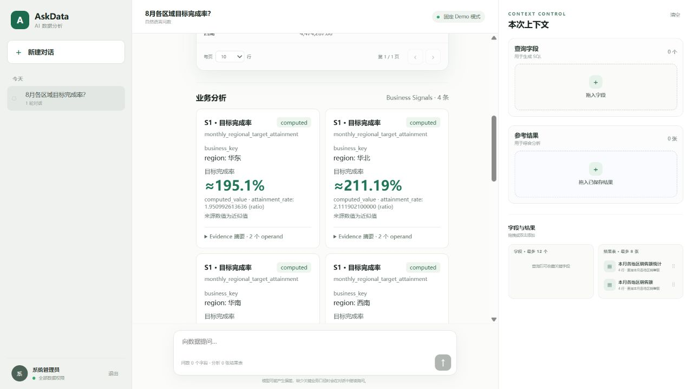
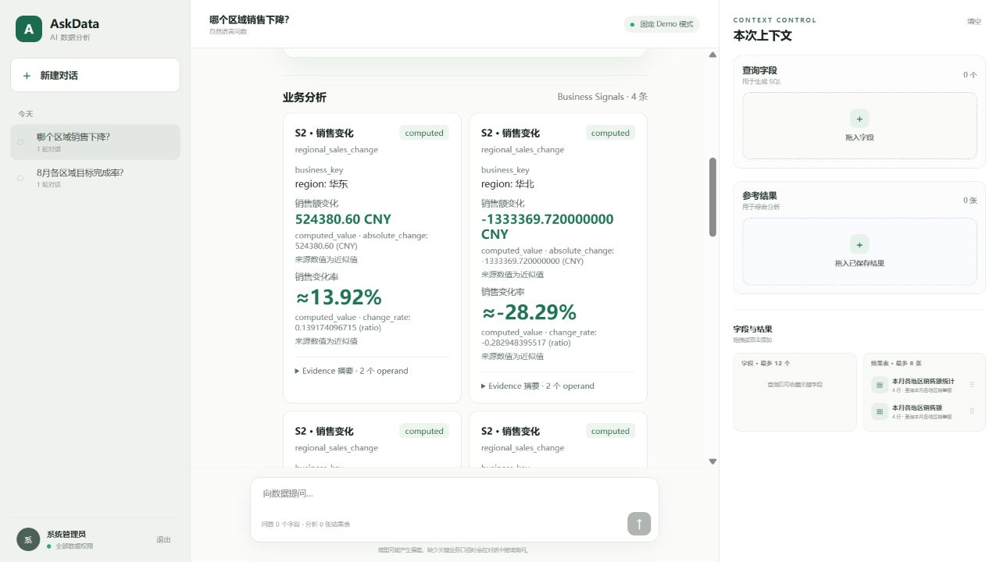
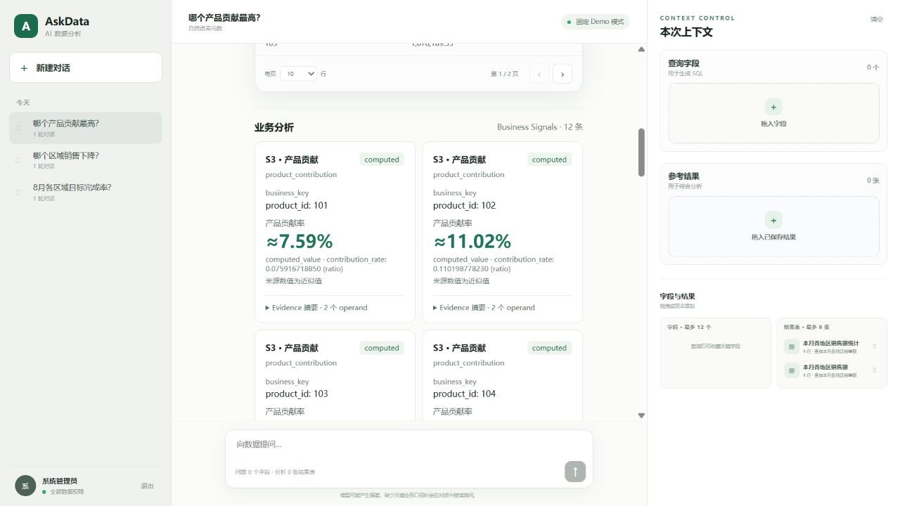

# Phase 5.0 Demo Integration Report

验收日期：2026-09-09。范围：现有 AskData 页面展示 SQL 结果、Business Signal、Explanation，不进行系统重构。

**结论：三个固定 Demo 和三种失败场景已完成真实浏览器联调；成功解释使用明确标注的 fixture 模式。真实 LLM 已尝试调用，当前配置被供应商以 HTTP 401 / invalid_api_key 拒绝。经用户确认，本轮完成 fixture 验收并保留这一限制。**

## 1. 前后端数据流

原有入口：`frontend/index.html → src/main.ts → App.vue`。`App.vue` 的输入框和推荐问题调用 `submit()`；`api.ts` 向 `POST /api/query` 发送 `{query, session_id, workspace}`，使用现有登录令牌。Vite 将 `/api` 代理到 `127.0.0.1:8000`。

后端链路：`app/main.py → api/routes.py::query → AskDataService.submit → QueryWorkflow.invoke`。正常工作流负责预处理、Schema 检索、SQL 获取和执行；SQL 成功后进入 `build_signal_batch → build_explanation_prompt → generate_explanation → ResultBuilder.with_explanation`，返回 `QueryResult`。前端原来使用 `ResultTableCard.vue` 展示 `columns/rows`，通过 SQL 按钮查看 `sql`，旧文字区读取 `analysis`。

调查发现两个展示缺口：

- 后端已有 `QueryResult.explanation: ExplanationResponse | None`，前端类型和展示尚未消费它。
- `SignalBatch` 留在工作流状态中，默认 `AskDataService()` 没有配置 `SignalSource`。只改前端无法让默认入口产生 S1/S2/S3。

本次增加独立 `run_demo.py`，使用原 HTTP 路由、登录和编译后的 QueryWorkflow；只对三个固定问题装配查询获取边界：

```text
现有输入框 / 三个推荐问题
  → POST /api/query → AskDataService.submit
  → DemoQueryWorkflow：固定问题、只读 SQL 目录
  → 原 DuckDB 执行已有 CSV → ResultContract
  → 原 Semantic Layer → BusinessContext
  → 显式 Demo 业务声明 + 原 Compatibility / Alignment / S1、S2、S3
  → 按 task、user、session、result_id、execution_digest 绑定的 SignalDelivery
  → 原 SignalEngine → SignalBatch
  → 原 ExplanationContext → PromptBuilder → ResponseGenerator → ResponseValidator
  → QueryResult：sql / columns / rows + business_signals + explanation
  → 原 ResultTableCard + 新 BusinessAnalysis 区域
```

固定 Demo 没有调用通用问题路由、向量检索、模型生成 SQL 或 MCP 获取 SQL；它验证的是固定数据获取边界之后的真实计算、解释和前后端集成。`run.py` 继续保持原通用查询行为，没有配置生产 SignalSource。

## 2. API 变化与最小展示契约

未新增查询端点，未改变请求参数、鉴权及原 `sql/columns/rows` 字段。

| 字段 | 本次处理 |
| --- | --- |
| `sql`, `columns`, `rows` | 原值透传，维持 SQL 表格 |
| `explanation` | 复用现有 ExplanationResponse，无重新设计 |
| `explanation.text` | 前端直接展示，仅在 `generation_status=generated` 时作为成功解释 |
| `explanation.generation_status` | 展示 generated / unavailable / not_requested / failed / validation_failed |
| `business_signals` | 唯一新增 QueryResult 顶层字段，默认 `[]` |
| `analysis` | 保留原兼容字段；新业务解释区以 `explanation` 为准 |

每个 `business_signals` 项包含：

```text
signal_index                 原 batch 索引
signal_type / status         原类型与状态
business_key                 原有 components / periods
computed_value               原公式结果字典；value 保持字符串，保留单位、品质与原因
evidence_summary[]
  evidence_id / context_role
  result_id / column_id / row_index
  source_fields[]             database / table / field
  business_key
  formula_refs[]              formula_id / formula_version
```

`app/api/signal_presentation.py` 只投影 `SignalBatch.displayable_signal_indices`，不改变排序、显示资格、业务键或数值；不返回完整 SignalEvidence。失败或非展示 Signal 仍由原 batch 和 ExplanationResponse 的状态、omissions 等机制保留，本区域不绕过已有显示规则。

新增投影独立于解释生成状态。LLM 或 Validator 失败时，已计算 Signal 仍可展示；不存在有效 batch 时返回空列表。`ResultBuilder.with_explanation` 增加可选 batch 参数，QueryGraph 只增加这一参数传递。

## 3. Frontend 变化

- 保持原对话页和 `ResultTableCard.vue`，SQL 展开、表格分页、保存及导出入口均沿用原组件；该文件未修改。
- 推荐问题替换为三个指定 Demo。
- 新增 `BusinessAnalysis.vue`：Signal 卡片、可展开 Evidence 摘要、解释区域。
- 卡片展示中文类型名称和原 `signal_type`、`status`、`business_key`、各公式的 `computed_value`。
- 百分比只对已有十进制字符串进行显示换算及两位小数舍入，保留原始值；有舍入显示 `≈`，近似输入明确提示。未使用表格行重新计算业务指标。
- 初始展示前 4 条 Signal；S3 提供“展开其余 8 条信号 / 收起信号”，没有删除后续结果。
- 非 generated 解释显示“解释不可用”，不会遮挡表格；查询本身失败时仍显示具体错误原因。
- 固定 Demo 使用独立模式标识。查询口径注明固定月份、fixture / 真实 LLM 和故障模式；fixture 明确标注未调用真实 LLM。
- 没有新增前端依赖。增加 5 个针对精确百分比显示、舍入进位、大数、undefined 和业务键的测试，使用现有 TypeScript 和 Node 内置测试工具。

浏览器发现并修复了 Demo 适配返回空 `retrieval={}` 导致旧 UI 调用缺失 `threshold.toFixed` 的问题。固定 Demo 没有检索数据，因此返回 `retrieval=null`、`schema_graph=null`，不伪造检索统计。

## 4. 三个 Demo 与截图说明

共同口径：已有 CSV，销售额为已支付订单的 `SUM(paid_amount)`，单位 CNY；固定 2026 年 8 月。S2 基期为 2026 年 7 月。原 CSV 浮点金额采用已有 `reporting_approx_v1`；S3 使用已有 `1e-12` 相对容差。没有修改数据、数据库结构或任何计算公式。

下列成功截图全部来自 **fixture 模式**。fixture 只返回模型应选择的合法展示枚举，DuckDB、语义层、计算器、SignalEngine、PromptBuilder、ResponseGenerator、Validator 和浏览器 API 请求均真实执行。截图按现有滚动页面分为 SQL、Signal、解释，未拼接或合成。

| Demo | 用户输入 | 真实结果与展示 |
| --- | --- | --- |
| Demo 1 / S1 | 8月各区域目标完成率？ | 4 行区域销售结果、4 条 S1；华北原比例 `2.111902100000`，显示约 **211.19%** |
| Demo 2 / S2 | 哪个区域销售下降？ | 4 行当期结果、4 条 S2；华北约 **−28.29%**、华南约 **−3.05%**；同时展示绝对变化 |
| Demo 3 / S3 | 哪个产品贡献最高？ | 12 个产品原结果按销售额降序；12 条 S3；产品 **102** 的原贡献比例 `0.110198778230`，显示约 **11.02%** |

Demo 1：卡片显示 S1、computed、区域键和完成率；展开 Evidence 可看到 actual / target、原公式版本、各自 result_id 和来源。解释区显示原 `explanation.text`。



[SQL 与表格](phase5_demo_assets/demo1_sql.png) · [Evidence 摘要](phase5_demo_assets/demo1_evidence.png) · [解释](phase5_demo_assets/demo1_explanation.png)

Demo 2：华北卡片显示负销售变化，Evidence 的 current / baseline 分别指向当前和历史订单结果；解释保留两个期间。



[SQL 与表格](phase5_demo_assets/demo2_sql.png) · [解释](phase5_demo_assets/demo2_explanation.png)

Demo 3：原表第一行产品 102；Signal 按已有 batch 顺序展示，不在前端新造排名。所有 12 条贡献可展开查看，原表下一页包含最后 2 行。



[SQL 与表格](phase5_demo_assets/demo3_sql.png) · [解释](phase5_demo_assets/demo3_explanation.png)

## 5. 启动方式

从项目根目录分别打开两个终端：

```powershell
# 后端：本轮已验证的离线模型选项模式
cd backend
.\.venv\Scripts\python.exe run_demo.py --llm fixture
```

```powershell
# 前端：使用项目已有 Node
cd frontend
.\npm-local.cmd run dev
# 也可以使用已配置 PATH 的 npm run dev
```

访问 http://127.0.0.1:5173 ，使用本地演示管理员 `admin / admin123`。S2 需要历史订单权限，受限 sales 账号不能访问该历史表。

修复本机 `backend/.env` 的模型配置后，重启后端即可尝试真实模型：

```powershell
.\.venv\Scripts\python.exe run_demo.py --llm live
```

三种故障注入分别使用以下命令替代后端启动命令，一次只启动一个 8000 服务；重启后刷新页面并重新登录：

```powershell
.\.venv\Scripts\python.exe run_demo.py --llm fixture --failure no-signal
.\.venv\Scripts\python.exe run_demo.py --llm fixture --failure llm
.\.venv\Scripts\python.exe run_demo.py --llm fixture --failure validator
```

故障开关仅限 Demo 启动参数；原 API 无客户端故障开关。交付时已恢复普通 fixture 服务和前端服务。

## 6. 联调结果

真实浏览器从登录、输入、提交到结果展示完成，未拦截或伪造浏览器 `/api/query` 响应。

| 场景 | SQL 表格 | Signal | Explanation / 页面 | 结果 |
| --- | --- | --- | --- | --- |
| S1 fixture | 4 行 | 4 条 computed | generated；原文可见 | 通过 |
| S2 fixture | 4 行 | 4 条 computed | generated；原文可见 | 通过 |
| S3 fixture | 12 行、原分页 | 12 条 computed，可展开 | generated；原文可见 | 通过 |
| 没有 Signal | 4 行保留 | 0 条 | unavailable / NO_SIGNAL_BATCH；解释不可用 | 通过 |
| LLM 调用故障 | 4 行保留 | 4 条保留 | failed / LLM_CALL_FAILED；解释不可用 | 通过 |
| Validator 拒绝 | 4 行保留 | 4 条保留 | validation_failed / RESPONSE_VALIDATION_FAILED；解释不可用 | 通过 |
| 真实 LLM 凭据失败 | 4 行保留（浏览器 S1） | 4 条保留 | failed；供应商拒绝当前 key | 降级通过，成功生成受阻 |
| 固定目录外问题 | 查询失败，不伪造表格 | 无 | 显示“此演示入口仅支持页面提供的三个固定问题” | 通过 |

Validator 故障在 Demo ResponseGenerator 边界破坏响应文本，由原图级 Validator 实际拒绝；未修改或替换 Validator。

[无 Signal 截图](phase5_demo_assets/failure_no_signal.png) · [LLM 失败截图](phase5_demo_assets/failure_llm.png) · [Validator 失败截图](phase5_demo_assets/failure_validator.png) · [真实凭据失败截图](phase5_demo_assets/live_llm_unavailable.png)

自动化验证：

- Backend：`python -m unittest discover -s tests -v`，**1265 tests passed**，包括原 1249 项、新增 API 集成 7 项、新增真实数据 Demo runtime 9 项。
- API 集成：包含 HTTP 登录/查询/任务回读、JSON 往返、显示索引、原值保留、无重算和深拷贝隔离。
- Demo runtime：包含真实 CSV/DuckDB/Semantic/Graph、三种失败、旧执行摘要拒绝、历史权限、重复目标源键拒绝及 live 模式无 fixture 兜底。
- Frontend：`npm test`，**5 passed**；`npm run build`，Vue/TypeScript 检查与生产构建通过。
- 浏览器：三个场景、SQL 展开、Evidence 展开、S3 展开/收起与原表分页、三故障场景通过；最终成功与故障页面控制台没有新增 Vue/JavaScript 错误。

## 7. 剩余限制与边界

1. **真实 LLM 成功尚未验收**：已对三个场景尝试真实调用，供应商返回 HTTP 401 / invalid_api_key。用户选择先交付 fixture 联调与报告；不会将 fixture 的 generated 标注为真实 LLM 成功。
2. Demo 只支持三个固定问句，采用显式 SQL 目录和业务声明；没有新增通用 Signal 规划器或生产 SignalSource。未来通用问数自动产生 Signal 仍需另一个阶段。
3. 日期固定为 2026-08 / 2026-07，不随“本月”滚动；目标口径、完整期间等是明确的 Demo catalog 声明，不代表生产数据治理已经完成。
4. Phase 4 的 LLM 负责选择受控展示形式；最终文字由既有 renderer 生成，并保留数值和引用。没有自由文本因果分析。S3 模板不输出排名结论；“最高”可由完整降序原表和对应贡献值查看，未修改 Prompt 来扩展解释能力。
5. 原表展示本次主查询的 SQL/columns/rows；参考目标、基期或总额通过 Evidence 来源和 result_id 追溯，本阶段未新增第二张结果表或完整 Evidence 浏览器。
6. 浮点源保留 approximate 品质，卡片显示百分比是展示舍入，精确输出字符串仍可见。S3 当前最高值约 11.02%，没有硬编码示例中的 40%。

受保护模块核对：BusinessSignal 计算器、SignalEngine、Compatibility、Alignment、NumericReader、PromptBuilder、ResponseValidator、LLM Prompt、数据库文件均未修改；未新增 Dashboard、图表系统、业务指标或大型前端依赖。
