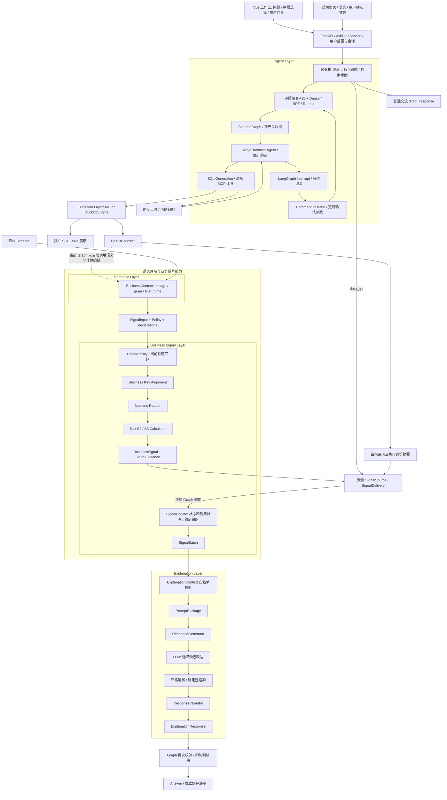

# Phase5.1 Project Story Document

适用场景：后端、AI 应用开发、数据平台方向面试。基于实际代码及 Phase 4 Final Audit 整理；面试源码基线为提交 `7d95fdc674c544bc531a956edea8722fadda87c3`（`freeze phase4 explanation layer`）。本任务仅新增文档，没有修改代码。

## 1. 一句话项目定位

**项目名称：AskData Studio——面向企业问数场景的受控数据分析 Agent。**

**一句话介绍：将多轮问题理解、字段级 Schema 检索、工具调用、人工澄清、受控 SQL 执行与可追溯业务解释组织在同一应用里，让用户既能用自然语言取得数据，也能核验受支持指标的计算依据。**

面试把它作为一个完整项目讲：**前半段解决“怎样让 Agent 找对数据并受控执行”，后半段解决“怎样让计算与回答值得信任”。** Business Signal 是整体架构中的计算层，不是项目的全部。

### 解决什么企业问题

企业用户通常不知道表名、字段名和关联关系，还会连续追问“那华东呢”，或在“销售额”这种业务词上存在歧义。系统首先要理解这次是在查新数据、解释已有结果，还是普通交流；再找出相关字段，在必要时澄清，并限制模型只能通过授权工具访问数据。

取得数据以后，用户问“本月华北销售目标完成得怎么样”，还需要确认销售额是实付金额还是下单金额、实际值与目标是否属于同一月份、地区是否正确配对，以及缺失时有没有补零。因此，这个项目同时处理查询交互、Agent 执行和业务答案可信三个问题。

用户侧提供 Vue 查询工作区、字段选择、澄清交互、SQL/表格查看、分页导出和结果收藏；后端用 FastAPI、LangGraph、字段级检索、本地 MCP 和 DuckDB 支撑查询过程，再通过结果契约与业务解释层组织可信输出。各阶段有独立状态和记录，便于定位问题发生在理解、检索、工具调用、执行、计算还是解释。

这里描述的是企业场景中的问题及项目的工程能力；当前没有线上企业部署规模、节省人时或业务准确率提升的实测数据。

### 相比直接串接 LLM 与 SQL 的工程亮点

| 常见风险 | 项目中的具体设计 | 可讲出的价值 |
| --- | --- | --- |
| 把所有 Schema 和聊天历史一次性塞进 Prompt | 近期轻量上下文辅助问题改写；字段级 BM25/Dense 双路召回、RRF 融合、Rerank 过滤；SchemaGraph 补充关联键 | 查询上下文按任务构建，既保留业务词匹配，也处理近义表达和关联关系。 |
| 模型直接决定流程和任意执行动作 | LangGraph 固定节点控制转移；Agent 从当前 MCP catalog 与应用 Skill 白名单交集中选工具，限制调用次数 | 保留工具选择的灵活性，同时让权限、流程和失败处理受程序约束。 |
| 缺失参数就猜测，或者澄清后丢失上下文 | `interrupt` 暂停，`Command(resume=...)` 恢复原 task，确认参数写回 workspace 后重新检索 | 用户补充信息成为明确状态，查询过程可以继续。 |
| 仅靠 Prompt 提醒模型不要越权 | 后端 AccessScope 过滤 Schema/工具，并在执行前验证 SQL AST 与表权限 | 检索相关性、用户确认与访问授权分别处理，模型选择不能代替权限检查。 |
| 根据列名或 SQL alias 猜指标 | ResultContract 保留列身份；BusinessContext 解析实际来源、聚合、grain、filter、time；Policy 再判断计算资格 | 同样叫“销售额”，来源不符合授权口径也不能直接计算。 |
| 让 LLM 在表格上做运算、对齐和业务判断 | Compatibility → Alignment → Numeric Reader → S1/S2/S3，输出统一 BusinessSignal | 业务规则和计算可以用固定输入复现、测试和版本化。 |
| 只有结果和一段事后解释，无法审计 | SignalEvidence 记录操作数身份、行列位置、观察值、质量和公式引用 | 能回到“使用了哪个结果里的哪个值”，不靠模型事后编造依据。 |
| 只用 Prompt 要求模型别编造 | 白名单 Prompt、受控表达选择、确定性渲染和当前包 Validator | 错误数值、错误引用和新增自由事实不会被发布为合法解释。 |
| 解释失败导致查询结果一起丢失 | Table 与 Explanation 独立返回状态 | 数据库查询成功时，即使模型或校验失败，表格仍可查看。 |

这些是项目的设计亮点，不需要包装为行业首创算法。面试主线是“让 Agent 能完成实际问数任务，同时把动作权限、业务计算与解释事实留在明确边界内”。

### 当前完成度的一句话补充

> 多轮问题预处理、Schema 检索、单库工具 Agent、澄清恢复、SQL 执行和表格返回已经接通；执行契约、语义理解和三类业务指标计算已经实现。已计算信号到受控解释的正式 Graph 也已接通。自动从查询结果选择输入、Policy、声明并调度 Calculator 的生产器还没有实现，目前使用受信 SignalSource 交付入口。

默认 API 未配置 SignalSource，因此普通查询可以返回 SQL 表格，没有现成业务信号时会明确显示解释不可用。这个边界与 Phase 4 冻结结论一致，不能讲成“任意问题都已自动贯通到业务答案”。

## 2. 整体架构：每层为什么存在

下面画的是**实际模块与交付关系**。虚线表示尚未由正式 Graph 自动编排的部分；框内的语义和计算函数已经实现，需要受信上游显式调用。

### 层次职责表

| 层 | 输入 | 输出 | 解决的问题 | 为什么保留独立边界 |
| --- | --- | --- | --- | --- |
| 应用与会话层 | 查询、用户身份、session、workspace、澄清回复 | 带访问范围的 QueryState；表格/解释/历史交互 | 支持多轮问数、用户确认、收藏及过程展示 | 会话与 UI 状态不应混进 SQL 生成和公式计算；历史文本也不是当前业务事实。 |
| Agent Layer | 近期轻量上下文、用户问题、SchemaGraph、确认参数、当前工具目录 | 独立问题、查询工具动作或澄清；执行载荷与 tool trace | 把模糊业务需求转为有限、可继续的工具执行过程 | Workflow 决定合法路径，模型决定受限语义动作；更换模型不应改变权限或状态机。 |
| Execution Layer | SQL、数据库、AccessScope | SqlExecution + ResultContract | 执行并保留列身份、类型、编码、行、截断和 provenance | 数据库真实返回值不能被模型描述取代；Table 的兼容展示也不应决定计算数值表示。 |
| Semantic Layer | ResultContract + 显式 Schema | BusinessContext | 识别输出列来源、聚合、grain、过滤和时间约束；保留 unknown/unsupported | “这列怎么得到”与“能否用于目标完成率”是不同问题，换业务规则不应改 SQL 语义解析。 |
| Business Signal Layer | 各角色 SignalInput、Policy、声明、当前 Compatibility/Alignment 回执 | S1/S2/S3 的 BusinessSignal + SignalEvidence | 证明可计算资格，按业务键配对，安全读取数值并计算 | 日期比较、指标口径和公式需要可复现测试，不应随语言模板或模型选择改变。 |
| SignalEngine / Batch | 已计算的 BusinessSignal 集合 | SignalBatch、displayable_signal_indices、状态统计和 limitations | 统一展示资格、引用及稳定顺序 | 它是组织器，不是 Calculator 调度器；批量展示无需重算单个指标。 |
| Explanation Layer | SignalBatch，随后是分离的 Context / PromptPackage | 经过校验的 ExplanationResponse | 将已经确定的事实转换为受控表达，保留引用及失败状态 | 语言变化不应修改数值、口径、资格或 Evidence；模型失败不应取消表格。 |

这些是同一后端中的逻辑边界，不要求拆成微服务。“不能合并”指不能混淆责任和合同，不代表必须拆进程。代价是模型、快照绑定和失败状态更多，V1 支持范围也更保守；收益是可以独立测试每一层，修改解释方式时不触碰计算口径。

图中的 SQL Generation 是 SingleDatabaseAgent 构造数据库工具参数的能力，不是另一个已实现的独立规划服务。SignalEngine 属于 Phase 3，但接收的是已计算 Signal；只有组织与展示资格检查，不负责自动调度 S1/S2/S3。

### 原始 Agent 主体：面试必须展开的部分

| 组件 | 实际实现 | 面试时的解释 |
| --- | --- | --- |
| 请求预处理 | [RequestPreprocessor](D:/agent_study/askdata_studio/backend/app/preprocessing.py:53) 一次调用返回 database_query / data_qa / direct_response，以及查询改写和 RetrievalIntent | “那华东呢”先结合近期上下文补全语义；新数据查询与已有结果解释走不同分支。模型不可用时保守结束，不贸然访问数据库。 |
| 字段级检索 | [SchemaIndex](D:/agent_study/askdata_studio/backend/app/retrieval/service.py:31)、[本地检索存储](D:/agent_study/askdata_studio/backend/app/retrieval/store.py:1) | BM25 匹配词汇，Dense 覆盖语义相近表达；RRF 按排名融合避免直接混加不同尺度的分数，再调用 Rerank 并按阈值筛选。索引以本地 JSON 存储，不宣称已部署向量数据库集群。 |
| Schema 关联图 | [SchemaGraphBuilder](D:/agent_study/askdata_studio/backend/app/retrieval/graph.py:11) | 对选中表按预定义关系做 BFS 路径连接，补齐关联键。不是模型临时猜 JOIN，也不宣称全局最优图算法。查询层可使用关系，不代表后面的 Semantic V1 支持所有 JOIN。 |
| 用户确认字段 | `include_workspace()` 验证访问范围后加入确认字段/表，标记 user_confirmed | 用户的显式选择不应被相关性阈值刷掉，但不能越过权限。确认字段加入上下文，不等于已经通过指标口径审计。 |
| 应用 Skill | [SkillRegistry](D:/agent_study/askdata_studio/backend/app/skills/registry.py:1) 读取行为说明、allowed_tools、output_actions 和调用上限 | Skill 描述这类任务允许怎样做；工具清单、动作类型和次数由代码检查，业务语义指导仍需要模型执行，不能把整个文本说明说成已被程序证明。 |
| MCP 工具边界 | [LocalMcpClient](D:/agent_study/askdata_studio/backend/app/mcp_runtime/client.py:1)、[本地 Server](D:/agent_study/askdata_studio/backend/app/mcp_runtime/server.py:21) | 每次请求发现工具目录，Agent 在目录与 Skill 交集中选时间或数据库工具。工具有参数/输出结构，并保留调用轨迹；当前为同进程 MCP，不是远程多 Agent 平台。 |
| 有限工具循环 | [SingleDatabaseAgent](D:/agent_study/askdata_studio/backend/app/querying/single_database_agent.py:13) | 默认最多 3 次、取配置和 Skill 上限的较小值；时间工具观察可进入下一步决策，首次数据库工具返回后结束。没有无限重试、自我反思或自动 SQL 修复循环。 |
| 人工澄清 | [Graph 暂停与恢复](D:/agent_study/askdata_studio/backend/app/workflows/query_graph.py:376)、[Service.clarify](D:/agent_study/askdata_studio/backend/app/services/askdata_service.py:128) | Agent 给出会影响结果的待确认项，Graph 暂停；Service 检查选项和用户后恢复同一 task，确认值写入 workspace，再做检索。 |
| 访问与执行控制 | [AccessScope](D:/agent_study/askdata_studio/backend/app/security/access_control.py:14)、[DuckDbEngine](D:/agent_study/askdata_studio/backend/app/querying/duckdb_engine.py:277) | 后端生成数据库/表权限，贯穿检索、SchemaGraph、工具注册和执行检查。AST 拒绝多语句、写入/管理操作、SELECT *、未知或未授权表；这些是明确规则，不等同完整数据库沙箱。 |

**三个“记忆”概念要分清。** [SessionContext](D:/agent_study/askdata_studio/backend/app/services/session_context.py:17) 的 route_context 只取近期轮次和表头，正式用于预处理；[ShortTermMemory](D:/agent_study/askdata_studio/backend/app/services/short_term_memory.py:36) 按近似 token 软阈值后台压缩较旧完整轮次，保留近期轮次，失败不丢原记录；[MemoryStore](D:/agent_study/askdata_studio/backend/app/services/memory_store.py:1) 保存用户手动收藏的字段和结果。它们不是同一种机制，也没有自动从长期向量记忆检索业务事实。

后台摘要能力已实现并可生成状态，但当前预处理不读异步摘要，Phase 4 解释也不读旧 analysis/short_term_context。SQLite 归档启用后可恢复历史与摘要，默认关闭；LangGraph 使用 InMemorySaver，不能把历史持久化讲成进程重启后仍能恢复原来的暂停执行点。

## 3. 完整请求链路：面试时怎样准确追踪

### 3.1 先讲已经贯通的 Agent 查询主线

先用“查询本月各地区销售额”展示系统怎样找到并返回数据，再扩展到业务指标解释。

1. **接收请求。** Vue 提交问题、session 和选中的字段；API 从登录身份取得用户，Service 生成访问范围、作用域会话和 task。普通追问与待澄清任务的选项回复会分别处理。
2. **理解意图。** 预处理器只看当前问题与近期轻量上下文，输出 PreparedRequest。新查询得到独立问题和 RetrievalIntent；“那华东呢”可以在此补全指代。普通交流不经过 SQL Agent，分析已有结果进入信号解释入口。
3. **找到 Schema。** 检索意图用于 BM25 和 Dense 召回，RRF 融合排名，完整问题用于 Rerank。程序补入已授权的用户确认字段，并用预定义关系构建 SchemaGraph、补齐连接键，再确定数据库。
4. **决定下一步动作。** 单库 Agent 获取当前 MCP catalog，在 Skill 允许的范围内返回 JSON 动作。对于“本月”，Skill 指导其先用日期工具确定边界；工具观察进入下一次决策，再生成带明确时间条件的 SQL。这里是代码解析动作后调用工具，不是依赖模型厂商原生 function-calling API。
5. **遇到歧义先澄清。** 如果 Agent 返回 clarification，Graph 暂停。用户选择经过 option_id 和所有者检查，用同一个 task_id 恢复；确认值进入 workspace，再走检索与 Agent。预处理器对意图灰区的普通提问，是另一条直接回复路径，不等同这个暂停点。
6. **通过工具执行。** 数据库工具在后端再次检查 SQL AST 和访问范围，调用 DuckDB。它返回结构化执行结果及 ResultContract。Agent 遇到第一次数据库工具结果就退出；Graph 随后恢复、校验和包装该结果。
7. **返回表格及执行状态。** 前端能查看 SQL、结果表、检索信息和执行轨迹，并分页、导出或收藏。执行失败有阶段和错误状态，不由模型伪造一张成功表格。
8. **单独生成业务解释。** 若受信 source 能交付当前请求的已计算 Signal，才进入 Batch → Prompt → Response → Validator；否则表格仍然有效，解释明确不可用。原始会话记录与业务 Evidence 是两种数据，不能相互替代。

这个例子能同时展示会话、检索、Agent、自主工具选择、程序约束、HITL 和前端交互；不要从 BusinessSignal 开始讲，省略用户到底怎样得到数据。

### 3.2 再讲从执行事实到业务答案的数据合同

以“查看某月华北销售目标完成率”为例，公式是 `actual_sales / target_amount`。需要两个已经取得、符合政策的输入结果；当前 Graph 不会因为这个问题自动补查目标表或自动选择 Policy。

下面使用三种状态：**正式路径**表示已有 Service/Graph 调用；**能力入口**表示库函数已实现但需上游编排；**受信交付**表示已有明确接线合同。

| 步骤 | 对应模块 / 入口 | 数据结构 | 为什么存在 / 实际状态 |
| --- | --- | --- | --- |
| 1. User Query | [routes.py](D:/agent_study/askdata_studio/backend/app/api/routes.py:125) → [AskDataService.submit](D:/agent_study/askdata_studio/backend/app/services/askdata_service.py:53) | QueryRequest → QueryState；含 session、task、用户访问范围 | 正式路径。建立一次有用户和会话作用域的请求，支持澄清与后续恢复。 |
| 2. 路由和 Schema 获取 | [query_graph.py](D:/agent_study/askdata_studio/backend/app/workflows/query_graph.py:330)、[SchemaIndex](D:/agent_study/askdata_studio/backend/app/retrieval/service.py:31) | PreparedRequest、检索结果、SchemaGraph | 正式路径。用字段级 BM25、Dense、RRF、Rerank 缩小查询上下文，并把确认字段交给 Agent。 |
| 3. SQL Agent | [SingleDatabaseAgent.prepare](D:/agent_study/askdata_studio/backend/app/querying/single_database_agent.py:28) | 受 Skill 约束的 call_tool / clarify 决策；工具参数与 tool trace | 正式路径。模型在有限次工具循环内生成 SQL、选工具或请求澄清，不生成业务结论。 |
| 4. Execution → ResultContract | [database_tools.py](D:/agent_study/askdata_studio/backend/app/mcp_runtime/tools/database_tools.py:26) → [DuckDbEngine.execute](D:/agent_study/askdata_studio/backend/app/querying/duckdb_engine.py:43) | SqlExecution；ResultContract(version, result_id, ExecutionData) | 正式路径。Contract 采用列 id/ordinal 和数组行保存可靠位置，保留 dtype、encoding、representation_status、截断等事实。 |
| 5. Graph 恢复结果 | [query_graph.py](D:/agent_study/askdata_studio/backend/app/workflows/query_graph.py:430) | 验证后的 execution_result；独立 QueryResult 表格 | 正式路径。检查 MCP 包与 Contract 一致性。SQL 在 Agent 调用工具时已执行；名为 `_execute_single_database` 的节点负责恢复、校验与包装，不再执行一次 SQL。 |
| 6. ResultContract → BusinessContext | [build_business_context](D:/agent_study/askdata_studio/backend/app/querying/result_understanding/builder.py:65) | BusinessContext：执行快照 + column_semantics、grain、filters、time_constraints、limitations | 能力入口。先拒绝 provenance 冲突，再解析已有 SQL 和绑定 Schema；不重新查询数据库。 |
| 7. 明确业务输入 | [SignalInput](D:/agent_study/askdata_studio/backend/app/querying/business_signals/models.py:278)、[Typed Policies](D:/agent_study/askdata_studio/backend/app/querying/business_signals/policies.py:278) | actual/target 的 context、selection、declarations 和 TargetAttainmentPolicy | 需要受信上游提供。明确哪些列作指标、哪些列作键、采用什么口径；不能靠同名 alias 猜测。 |
| 8. Compatibility | [check_context_compatibility](D:/agent_study/askdata_studio/backend/app/querying/business_signals/compatibility.py:748) | ContextCompatibility + 完整输入绑定 | 能力入口。确认本次操作的 metric、期间、过滤、单位等资格；回执绑定实际 Policy 内容、selection、声明和规范语义。 |
| 9. Alignment | [align_context_keys](D:/agent_study/askdata_studio/backend/app/querying/business_signals/alignment.py:344) | AlignmentResult / AlignmentPair / 来源绑定 | 能力入口。进入键提取前验证回执，按地区键配对，明确 missing/duplicate；不同 row 顺序不能造成串配。 |
| 10. Numeric → Calculator | [Numeric Reader](D:/agent_study/askdata_studio/backend/app/querying/business_signals/numeric.py:211)；[S1](D:/agent_study/askdata_studio/backend/app/querying/business_signals/target_attainment.py:217)、[S2](D:/agent_study/askdata_studio/backend/app/querying/business_signals/sales_change.py:247)、[S3](D:/agent_study/askdata_studio/backend/app/querying/business_signals/product_contribution.py:295) | NumericReadResult → list[BusinessSignal] | 能力入口。Calculator 验证当前 receipt/alignment 后读取数值并执行固定公式；NULL、零分母和拒绝状态不会被偷偷转换为正常结果。 |
| 11. Evidence | [build_signal_evidence](D:/agent_study/askdata_studio/backend/app/querying/business_signals/evidence.py:25) | 每个 Signal 的 evidence[] | Calculator 在计算过程中提供既有 Context、AlignmentPair、NumericReadResult 和 formula refs；Builder 记录依据，不再读取行或重算。 |
| 12. BusinessSignal → SignalBatch | [SignalDelivery](D:/agent_study/askdata_studio/backend/app/workflows/signal_delivery.py:31) → [Graph 信号节点](D:/agent_study/askdata_studio/backend/app/workflows/query_graph.py:237) → [SignalEngine.build](D:/agent_study/askdata_studio/backend/app/querying/business_signals/engine.py:40) | SignalRequest / SignalDelivery → SignalBatch | 受信交付及正式路径。验证当前请求和执行身份，组织既有 Signal；Engine 不选择指标，也不调用 Calculator。 |
| 13. Batch → PromptPackage | [Context Builder](D:/agent_study/askdata_studio/backend/app/querying/explanation/context_builder.py:124) → [Prompt Builder](D:/agent_study/askdata_studio/backend/app/querying/explanation/prompt_builder.py:235) | ExplanationContext → PromptPackage | 正式路径。只投影白名单事实、Evidence 摘要、受控 variants 和 limitations；不把 SQL rows 或旧 analysis 送入解释 Prompt。 |
| 14. ResponseGenerator | [generate_from_prompt_package](D:/agent_study/askdata_studio/backend/app/querying/response_generator.py:24)、[Response Adapter](D:/agent_study/askdata_studio/backend/app/querying/explanation/response_adapter.py:36) | PromptPackage → 模型表达选择 → ExplanationResponse 候选 | 正式路径。模型只返回 signal_index、固定 variant 和 summary/operands 选项；事实和文字由程序按当前包渲染。 |
| 15. Validator → Answer | [validate_response](D:/agent_study/askdata_studio/backend/app/querying/explanation/validator.py:171) → [Graph 附加解释](D:/agent_study/askdata_studio/backend/app/workflows/query_graph.py:293) | ValidationResult → ExplanationResponse → QueryResult | 正式路径。对比当前事实、公式、单位和带作用域的 Evidence；不一致则 validation_failed，保留成功表格。 |

### 用一个数字例子把链路讲清楚

在显式提供的合格 S1 输入中，华北 actual=100、target=200。Compatibility 确认来源与期间，Alignment 定位同一地区的两行，Numeric Reader 提供 Decimal 工作值，Calculator 产生完成率 `0.500000000000`。两个 Evidence 记录各自 result_id、column_id、row_index、观察值、质量与公式。

随后才把这个已经计算好的 Signal 交给 SignalEngine。模型不计算 `100 / 200`，也不能自行把这个值改成百分比或推断“表现优秀”；它选择受控表达，由程序保留原数值和引用。若 target=0，结果是 undefined；若 target 缺失，不会假造一个 target=0。

### 两个容易被问穿的边界

**能执行的 SQL，不一定能完整做语义理解。** 当前 Semantic V1 对 SQL 支持范围有限；JOIN、CTE、窗口、子查询等超出支持范围时保留 unsupported。`BusinessContext.resolved` 也不等于已经满足业务计算资格。

**返回完整查询结果，不一定取得完整业务总体。** ResultContract 的 `complete_query_output` 描述这条 SQL 的输出；一条带 LIMIT 的 SQL 即使完整返回了十行，也不能证明这十行可作业务总体。S3 分母和 partition coverage 需要另有政策及证据约束。

## 4. 面试版三分钟项目介绍

以下按正常语速约三分钟，可直接练习口述：

> 我做的项目叫 AskData Studio，是一个面向企业问数场景的数据分析 Agent。用户可以连续提问、选择字段、补充澄清条件，查看 SQL 和结果表，也可以查看受支持业务指标的解释。我把它作为一个从查询交互到结果核验的完整应用来设计，前端用 Vue，后端用 FastAPI 和 LangGraph。
>
> 项目主要有两个难点：一是用户说业务语言，不知道表和字段，还会追问“那华东呢”；二是查到了数据，也不一定算对了业务指标。所以我先解决怎样让 Agent 找对数据、受控执行，再解决结果怎样可信。
>
> 查询入口先结合近期轻量上下文，区分新查询、已有结果解释和普通交流，并把追问改写成独立问题。Schema 检索采用字段级 BM25 和向量双路召回，按排名融合后再精排，补上表关联键，形成 Agent 使用的 Schema 图。用户确认的字段也会进入上下文，但不能越权。
>
> Agent 从当前 MCP 工具目录中选择动作，应用 Skill 限制工具、动作和调用次数。它可以先调用时间工具，再生成 SQL；遇到会改变结果的歧义，就通过 LangGraph 暂停，用户确认后恢复原任务。模型负责受限的工具决策，程序负责流程和权限。数据库工具执行前还会检查只读 SQL 和表权限。
>
> 结果侧，我保留了执行契约和语义层，记录数值表示、字段来源、聚合和时间条件。目标完成率、销售变化、产品贡献率由独立程序判断资格、按业务键对齐，再用 Decimal 计算。资格回执绑定当前输入，Evidence 保留具体操作数，避免旧结果误用和事后编造依据。
>
> 解释模型只选择受控表达，程序渲染数字和引用，再用 Validator 对照当前事实。解释失败不会丢掉成功的查询表格。这样，Agent 的灵活性和业务结果的可验证性可以同时保留。
>
> 当前冻结版本有 1249 项后端测试通过，查询、工具、澄清及业务合同都有对应覆盖。它目前是本地单库原型；已计算信号到解释已接通，自动选择业务输入和 Policy 的生产器还没完成。我没有宣称线上准确率提升，项目的主要成果是建立了可追踪、可测试、失败时有明确边界的问数流程。

这段讲解的主线是：用户问数体验 → 检索与 Agent 执行 → 澄清和权限 → 计算与解释可信 → 测试及完成边界。前三分之二让面试官理解完整查询系统，再用结果可信能力说明项目深度；不需要把所有类名逐个背出来。

## 5. 五个高概率技术追问：每题约三十秒

### 问题一：为什么用 BM25、Dense、RRF，再加一层 Rerank？

> 用户的业务叫法和字段名不总一致。BM25 擅长关键词匹配，Dense 补充语义相近表达，但两路分数尺度不同，所以用 RRF 融合排名，再用完整问题精排并设阈值。最后补上关联键和已授权的确认字段，形成 SQL Agent 的上下文。当前是本地字段索引，我能解释机制和测试，没有用线上指标证明召回收益。

代码依据：[SchemaIndex](D:/agent_study/askdata_studio/backend/app/retrieval/service.py:87)、[SchemaGraphBuilder](D:/agent_study/askdata_studio/backend/app/retrieval/graph.py:128)。RRF 使用 `1 / (60 + rank)`，不是把 BM25 分数直接加向量分数；Schema 图是 BFS 路径并集，不是全局最优连接求解。

### 问题二：你的 Agent 自主到什么程度？Workflow、Skill 和 MCP 各管什么？

> Workflow 控制合法节点和暂停恢复，模型在节点内选择澄清或工具动作；Skill 限定动作、工具和次数，MCP 提供工具发现、参数结构及调用通道。数据库工具真正执行 SQL，并再次检查访问范围和 AST。当前默认最多三次工具决策，数据库工具返回就结束，是受控单库 Agent，没有无限规划或自动修复 SQL 循环。

代码依据：[SingleDatabaseAgent](D:/agent_study/askdata_studio/backend/app/querying/single_database_agent.py:28)、[SkillRegistry](D:/agent_study/askdata_studio/backend/app/skills/registry.py:26)、[MCP Server](D:/agent_study/askdata_studio/backend/app/mcp_runtime/server.py:21)。隐藏工具不是全部安全措施；后端执行校验仍然必要。3 次指工具决策次数，不是包含网络重试在内的整个请求模型调用总数。

### 问题三：多轮追问、人工澄清和记忆是怎样衔接的？

> 普通追问由近期轻量上下文帮助改写；会影响查询结果的歧义，则由 Agent 返回结构化选项，用 interrupt 暂停。用户确认后检查所有者和选项，再按同一 task 恢复，条件写进 workspace。历史还分原始归档、后台摘要和手动收藏，但它们不能替代当前业务事实。现在 checkpoint 在内存里，不承诺重启后恢复执行断点。

代码依据：[SessionContext](D:/agent_study/askdata_studio/backend/app/services/session_context.py:123)、[澄清恢复](D:/agent_study/askdata_studio/backend/app/workflows/query_graph.py:378)、[ShortTermMemory](D:/agent_study/askdata_studio/backend/app/services/short_term_memory.py:91)。预处理只读取 route_context；不要把后台摘要讲成已被当前解释 Prompt 消费。

### 问题四：SQL 已经执行成功了，为什么还需要语义层和 BusinessSignal？

> 执行成功只说明查到了结果，不代表业务口径可比。语义层描述字段来源、聚合、粒度和时间；业务层再按 Policy 判断资格、按地区键配对，用 Numeric Reader 和 Decimal 计算。回执绑定实际输入，防止换了字段或政策仍用旧资格。Signal 保存结果，Evidence 保存具体操作数，缺失或零分母有明确状态，不能靠模型猜。

代码依据：[BusinessContext Builder](D:/agent_study/askdata_studio/backend/app/querying/result_understanding/builder.py:65)、[Compatibility](D:/agent_study/askdata_studio/backend/app/querying/business_signals/compatibility.py:748)、[Receipt Binding](D:/agent_study/askdata_studio/backend/app/querying/business_signals/receipt_binding.py:49)、[Evidence](D:/agent_study/askdata_studio/backend/app/querying/business_signals/evidence.py:25)。内容摘要防止错误复用，不是数字签名；Evidence 记录来源，不独立认证数据库事实。

### 问题五：Prompt 已经限制模型，为什么还要 Validator？

> Prompt 是行为要求，Validator 是输出能否发布的确定性门禁。我的模型只允许选择固定表达；程序渲染后，Validator 还会把数字、单位、公式、Signal 和 Evidence 引用与当前包比较。一个结构合法但把 0.5 改成 0.6 的回答也会被拒绝。失败返回 validation_failed，没有 SQL rows 或旧 analysis 回退。

代码依据：[Response Adapter](D:/agent_study/askdata_studio/backend/app/querying/explanation/response_adapter.py:66)、[Validator](D:/agent_study/askdata_studio/backend/app/querying/explanation/validator.py:171)。保证范围是“输出忠于当前受信输入”，不保证上游原始业务数据本身正确，也不是对任意自然语言做事实审核。

## 6. 面试时可以使用的效果证据与边界

| 可以明确陈述 | 证据或边界 |
| --- | --- |
| 已接通用户请求到单库查询结果的 Agent 主线 | 三路路由、独立问题、Schema 检索、工具选择、HITL、MCP/DuckDB 执行、SQL/表格返回。数据库执行发生在工具调用时。 |
| 原始 Agent 能力有独立测试覆盖 | [预处理](D:/agent_study/askdata_studio/backend/tests/test_preprocessing.py:1)、[Service/检索/澄清](D:/agent_study/askdata_studio/backend/tests/test_service.py:1)、[MCP](D:/agent_study/askdata_studio/backend/tests/test_mcp_runtime.py:1)、[Skill](D:/agent_study/askdata_studio/backend/tests/test_skills.py:1)、[访问控制](D:/agent_study/askdata_studio/backend/tests/test_auth.py:1)、[摘要](D:/agent_study/askdata_studio/backend/tests/test_short_term_memory.py:1)、[归档](D:/agent_study/askdata_studio/backend/tests/test_session_archive.py:1)、[收藏](D:/agent_study/askdata_studio/backend/tests/test_memory_store.py:1)。没有另造检索质量或线上效果数字。 |
| 已实现三个固定业务计算器和统一 Evidence / Batch 合同 | S1 目标完成率；S2 差额及变化率；S3 产品/品类贡献率。 |
| 已有 1249 项 backend 测试通过 | 来自最近一次 [Phase 4 Final Audit](D:/agent_study/askdata_studio/learning_report/askdata_phase4_final_audit_report.md:1)；Business Signal 654，Explanation 145，Workflow/Service 70，分组有重叠，不能相加。 |
| 当前快照错配和模型事实篡改有明确负例覆盖 | 修改政策、声明、选择或回执；错配 Evidence；undefined 改零；自由事实及非法模型回复等。测试数量不是业务准确率。 |
| 确定性函数通过 A→A、A→B→A 和输入不修改检查 | 指固定输入下的计算、投影、固定表达渲染和校验；不代表真实 LLM 选择永远相同。 |
| 模型失败与表格路径分离 | SQL 成功仍能查看表格，解释失败明确返回独立状态。 |
| 已计算信号到解释的正式 Graph 已连接 | 默认 SignalSource 尚未配置；没有自动语义/Policy 选择和 Calculator 调度生产器。 |

不要把本地 DuckDB/CSV 数据源讲成已经接入企业数仓集群；不要把进程内 MCP 工具循环讲成分布式多 Agent 平台；不要将当前受限 SQL 语义支持讲成通用 SQL 理解。当前访问控制是演示角色的数据库/表级规则，不是字段/行级权限或完整租户平台；历史归档恢复也不代表任务所有权和工作流断点已经获得完整的持久化保障。

回答“能不能保证不出错”时，应区分三种状态：模型路由/检索可能失误，执行层拒绝违反规则的动作，业务解释层拒绝不满足合同的事实。受控表达 Validator 的保证只覆盖当前信号解释链，不能扩大成所有原始 Agent 提示、普通直接回答都已消除幻觉。

后续若讨论路线，可以说“下一步是显式的业务输入选择与受信生产器接入，再用业务用例评估覆盖率和实际可用性”。这是后续工作方向，本阶段没有实现。

本轮依据真实代码整理文档，没有新增功能、修改代码或重新运行测试。测试结果引用刚完成的 Phase 4 审计，不虚构本轮新测结果。整理期间检测到工作区另有业务信号展示相关的并行改动；本任务未修改这些文件，也未把这些未审计改动计入上述冻结基线及面试成果。

版本核对备注：现有 `phase4-explanation-v1` tag 实际仍指向 `77c1aba97c2a99571a290bd018f6dcfcd5c35d3c`（Phase 2 提交），与包含 Phase 4 实现的 `7d95fdc6` 不一致。本材料以实际实现提交为依据；本任务没有移动或重建 tag。
